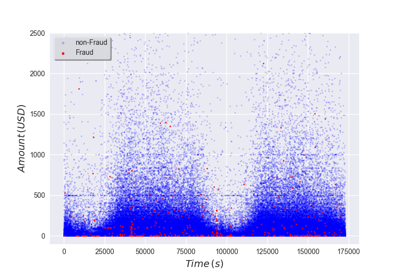
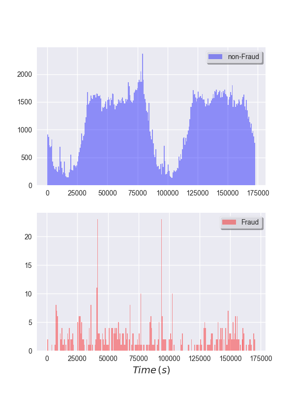
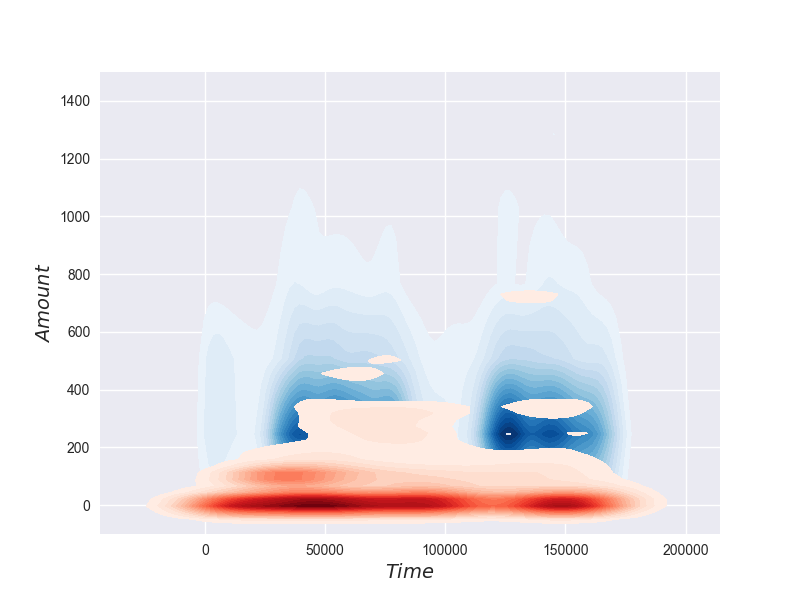
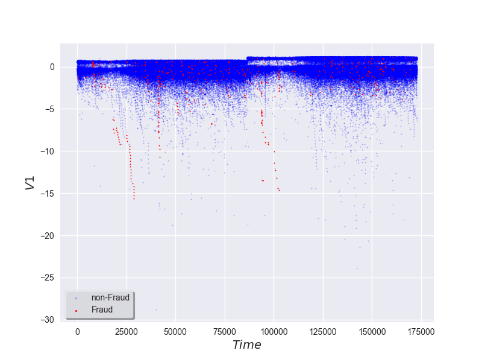

# [Home](index) || [Research](research) || [Projects](projects) || [Kaggle](kaggle)
 
## Current Projects
Credit Card Fraud
[NYSE](nyse) 

# Credit card fraud
The data used in this analysis was obtained from Kaggle and can be found <a href="https://www.kaggle.com/dalpozz/creditcardfraud">here</a>. More information on this data set can be found in the README\_creditfraud file in my Projects repository.

## Analysis
This data set contains 284,807 samples and 31 features. The features are: <i>Time</i>, <i>Amount</i>, <i>V1</i>, <i>V2</i>, ..., <i>V28</i>, and <i>Class</i>. The dimensionality of the original data set has been reduced using principal component analysis to obtain the <i>Vi</i>'s, and we aren't given any information about what these features represent. This is also a highly imbalanced data set. There are only 492 fraud cases out of 284,807, which accounts for 0.173% of all samples

The scatter plot in Fig.1 below shows the relationship between the amount of each credit card transaction, the time in seconds after the first transaction, and whether or not the transaction was fraudulent.
 

<strong>Fig.1</strong>

 
We can see that there is periodic variation in the data with a period of approximately 80,000 seconds, <i>i.e.</i> one day. So, we're looking at a two-day data set here. The legitimate transactions follow this periodicity fairly well, but we can't really tell any information about the periodic behavior of fraudulent cases since there are so few of them. Fig.2 shows the histogram of transactions binned by time. Fraudulent cases look to be somewhat evenly distributed in time except for a couple peaks at the beginning and end of the first day's transactions.
 

<strong>Fig.2</strong>

 
Fig.3 shows the kernel density estimate for time and amount for both cases. We can see that fraudulent cases (red) are likely to be for low dollar amounts. Legitimate transactions are also more likely to be low dollar amounts, but the blue regions extend further up in the plot. 
 

<strong>Fig.3</strong>

 
In terms of dollar amounts, some periodic behavior is starting to appear in the kernel density plot and it looks as though the fraudulent cases follow the same trends as the non-fraudulent cases. However, if we take a look at some of the other features we can see that fraudulent cases are more likely to occur at typical "down times." In Fig.4, we have a scatter plot of V1 vs. time.
 

<strong>Fig.4</strong>

 

