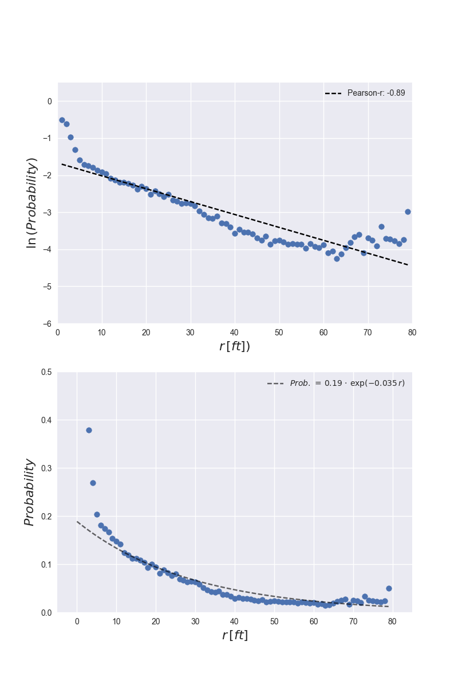
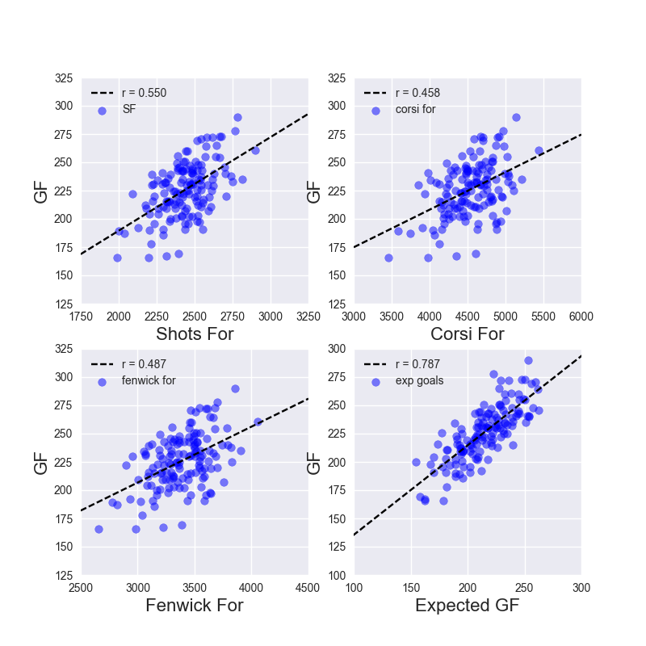

# [Home](index) || [Research](research) || [Projects](projects)
 

* * * 

## Projects

*   [Indeed.com: Data Science, Machine Learning, & AI jobs across the US](indeed)
*   [Twitter Streaming & Sentiment Analysis for Game 7 of the NHL Eastern Conference Finals: Penguins vs. Senators](hockeytweets) 
*   [(Kaggle) Titanic: Machine Learning from Disaster](kaggle_titanic) 
*   Data Incubator Project Proposal

<!-- *   [(Kaggle) House Prices: Advanced Regression Techniques](kaggle_houseprices)  -->
<!-- *   [(Kaggle) Personalized Medicine: Redefining Cancer Treatment](kaggle_cancer)  -->

* * * 

