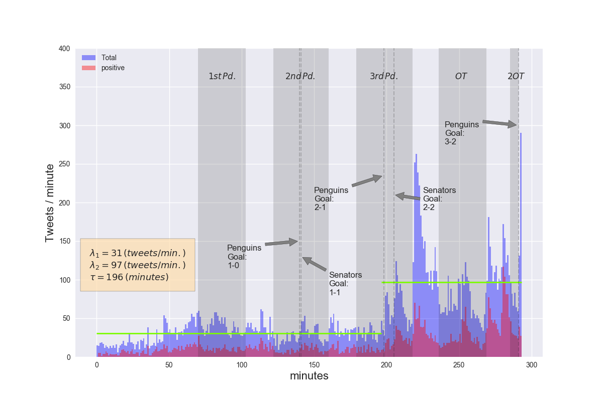
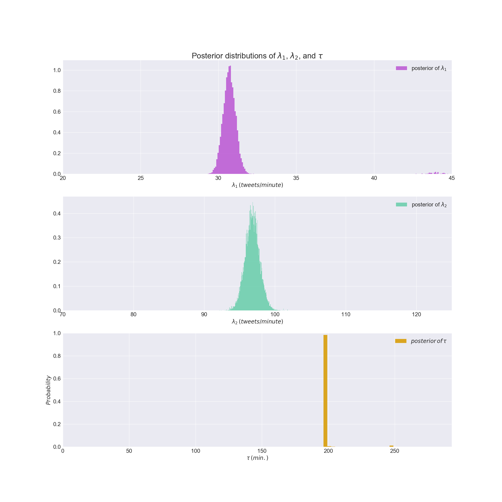

# [Home](index) || [Research](research) || [Projects](projects)
 

* * * 

## Current Projects

*   Twitter Streaming During Game 7 Eastern Conference Finals: Penguins vs. Senators
*   [Credit Card Fraud](creditcardfraud)
*   [NYSE](nyse) 

* * * 

# Twitter Streaming of Eastern Conference Finals Game 7 between the Pittsburgh Penguins and Ottawa Senators

Game 7 of the Eastern Conference Finals was one of the most stressful games I've ever watched as a Penguins fan. It took the Penguins two heart-palpitation-inducing overtime periods to score a goal by Chris Kunitz. No team has won back to back Stanley Cups in the salary cap era, and the Penguins stand a chance to be the first when they faceoff against the Nashville Predators. The last team to do it was the Detroit Red Wings in 97-98. Before that, the Pittsburgh Penguins in 91-92. 

I live streamed tweets in the moments leading up to the game and for the duration of the game, amassing a total of 15,208 tweets (64MB) with keywords: 'sidney crosby', 'pittsburgh penguins', 'ottawa senators', 'nhl playoffs', and 'stanley cup.'

The streaming began about an hour before the first faceoff and from the histogram of tweets-per-minute, we can see that tweeting begins to pick up about 20 or 30 minutes before gamtime and remains fairly constant for most of the game. It's pretty clear that towards the end of the game tweet frequency increases. I've used a Markov Chain Monte Carlo (MCMC) simulation to determine at what time the frequency changes, and what the frequencies are before and after that time. Given the data and using a Poisson model for counting the number of tweets-per-minute, the MCMC simulation samples the three parameters $$ \lambda_1 $$, $$ \lambda_2 $$, and $$ \tau $$  which are the initial tweeting rate, the final tweeting rate, and the time at which they change respectively. The posterior distributions for these parameters are shown in the plot below.

I've taken the most likely values of each of these parameters to plot in the first figure. Each of the $$ \lambda_i $$ frequencies is plotted in green, and the break takes place at the most probable value of $$ \tau $$. The MCMC simulation looks to be confident that the frequency of tweeting changed at $$ t = 196 $$ minutes. This is right when the Penguins scored in the third period to make it 2-1. Ottawa came back a few minutes later to tie the game and send it into overtime. We can see the spikes in tweets that occurred right after each of these goals. There was a huge spike in tweets right after the third period ended and lasted until the first OT period started. Tweeting settled down a little bit during that period, until again they spiked after the first overtime. There was a final spike in tweeting right after the Pens scored the game winner in 2OT.

