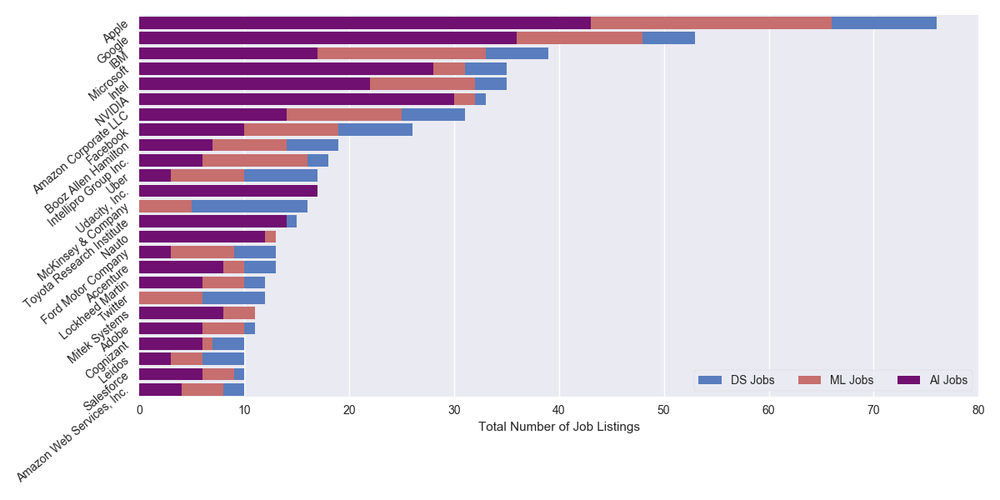
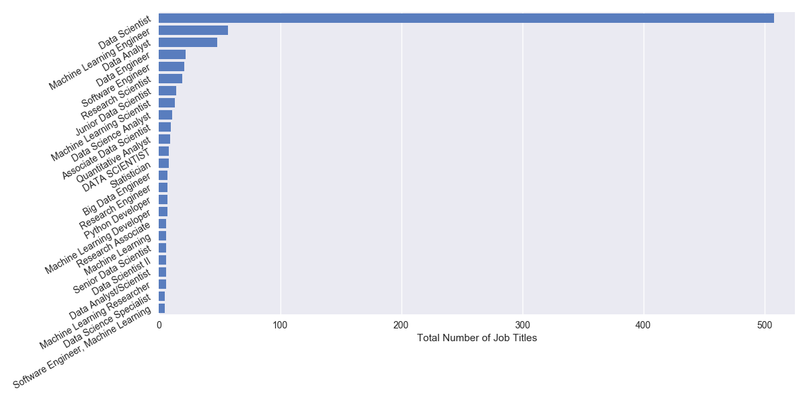
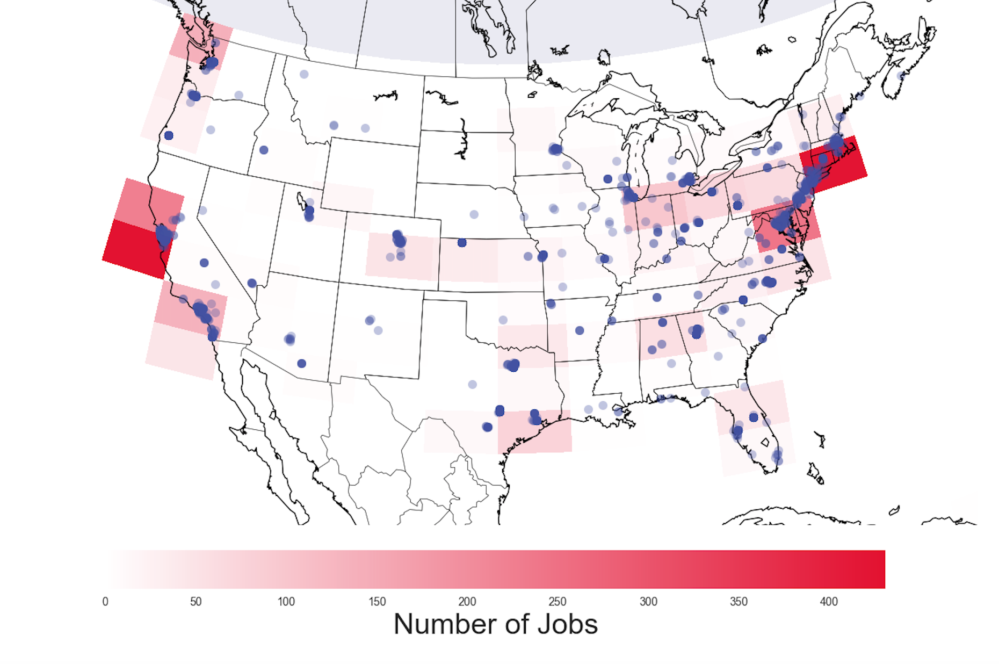
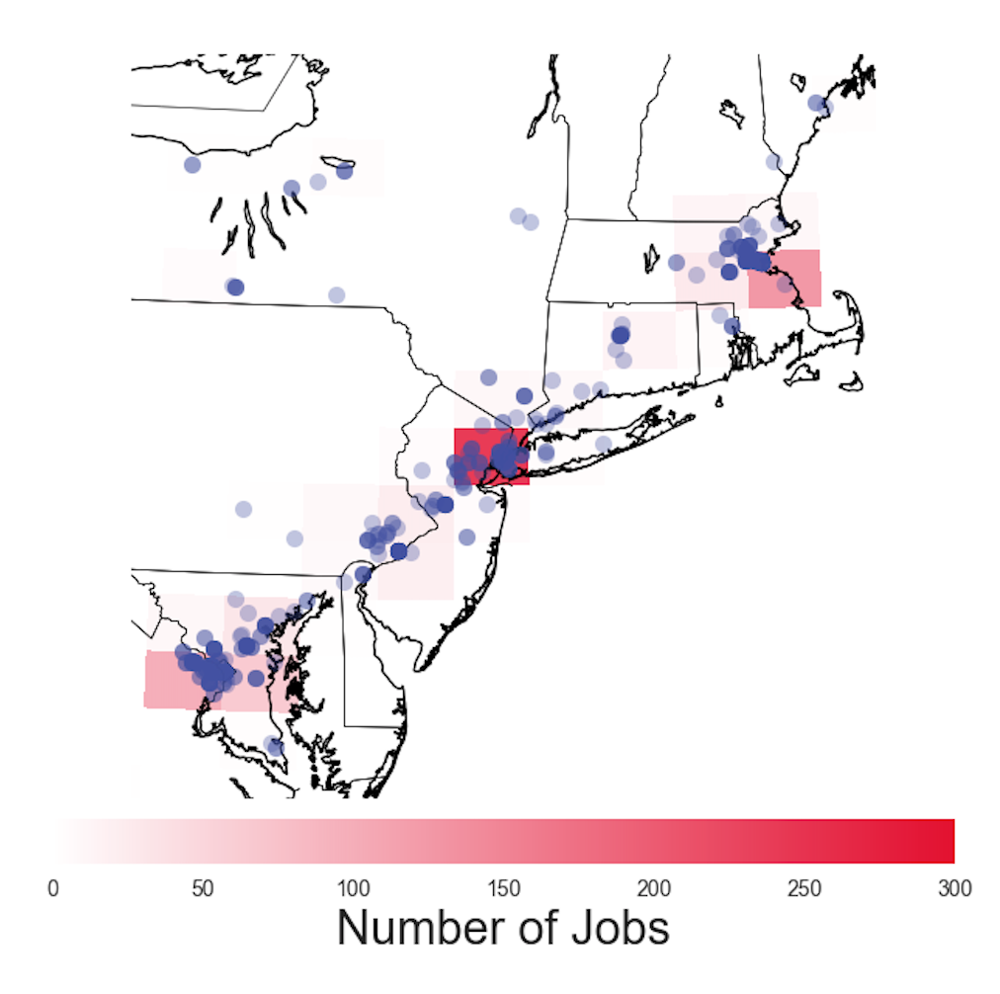
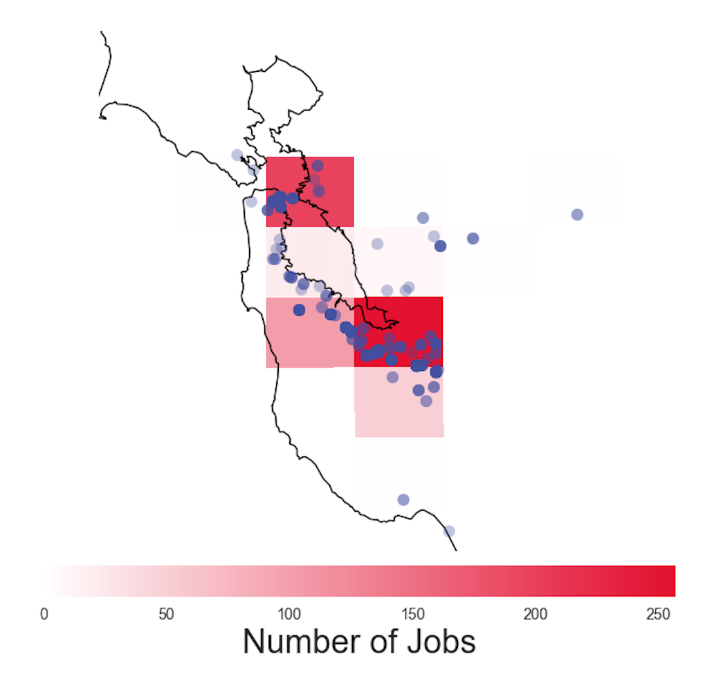

# [](#header-1)[Home](index) || [Research](research) || [<font color="MediumSlateBlue">Projects</font>](projects)
<br/>

* * * 

## [](#header-2)Projects

*   <font color="MediumSlateBlue">Indeed.com: Data Science, Machine Learning,<br/>& AI jobs across the US</font>
*   [Twitter Streaming & Sentiment Analysis for<br/>Game 7 of the NHL Eastern Conference Finals:<br/>Penguins vs. Senators](hockeytweets)<br/>
*   [(Kaggle) Titanic: Machine Learning from Disaster](kaggle_titanic)<br/>
<!-- *   [(Kaggle) House Prices: Advanced Regression Techniques](kaggle_houseprices)<br/> -->
<!-- *   [(Kaggle) Personalized Medicine: Redefining Cancer Treatment](kaggle_cancer)<br/> -->


* * * 
<br/>
# [](#header-1)<center><i>INDEED.COM: DATA SCIENCE, MACHINE LEARNING, AND AI JOBS ACROSS THE US<i/><center/>
<br/>
<br/>
# [](#header-2)I. INTRODUCTION
I got the idea for this project since I'm interested in data science, machine learning, and artificial intelligence, and I'm currently looking for a career in these fields. I wanted to examine such things as geographical locations of jobs, company sizes (start ups vs. older corporations), company ratings, salary information, and possibly some common keywords given in job summaries that could give information on job requirements.

The job listing contained in this analysis were scraped from Indeed.com on Sept. 5, 2017. It would be interesting to track some of the features over time to see if there are any seasonal or yearly changes in data science, machine learning, and artificial intelligence job opportunities.

The code that I wrote for this project can be found in my [Projects/Indeed](https://github.com/mrbrins82/Projects/tree/master/Indeed) repository.

<br/>
<br/>
# [](#header-2)II. GETTING THE DATA
<br/>
# [](#header-3)<center>Part 1. Web Scraping<center/>
Before scraping data from Indeed.com, I checked their <a href="https://www.indeed.com/robots.txt">robots.txt</a> page to see their rules about web crawling. There was nothing disallowed about scraping from general job search results, but they disallow scraping from their _/viewjobs?_ pages, which unfortunately means that I couldn't get any information from specific job pages. This means that I was limited to only getting summary information shown on the general search results pages. The information that I was able to get was for _jobtitle_, _company_, _location_, _salary_, _company size_, _company rating_, and the short _summary_. For company size, I used the number of ratings that a company has, assuming that a larger company is more likely to have more employees give a rating, and vice versa for smaller companies. To measure a company's rating, I use the number of stars given out of a maximum five star rating. Indeed doesn't give the number of stars, but rather the stars are filled in with yellow coloring that is given by a pixel width that I use as the metric for company rating. 

<br/>
# [](#header-3)<center>Part 2. Converting City Location to Coordinates<center/>
When scraping job listings from Indeed.com, we take in the city, state, and zip code. Sometimes we only get a city, sometimes we only get a state. We need to turn these locations into coordinates in order to plot job locations on a map of the US. Python has a method for doing this, but we're limited to 2500 requests per day (click <a href="https://developers.google.com/maps/documentation/geocoding/usage-limits">here</a> for usage limits page), for free at least. Rather than make these requests every time I ran the scraper, or wanted to make a plot, I decided to make this a separate program that could take locations that I already had and store the coordinates in another csv file, that could be used anytime in the future. Also, I won't have to make requests for coordinates to any new jobs in the future if I've already gotten them and have them stored in the _locations.csv_ file.

```python
import numpy as np
import pandas as pd
import os
 
from geopy.geocoders import Nominatim
 
# load job files
ai_df = pd.read_csv('jobs_artificial_intelligence.csv')
ds_df = pd.read_csv('jobs_data_scientist.csv')
ml_df = pd.read_csv('jobs_machine_learning.csv')
 
# make one data frame out of all job files and drop duplicates
temp_df = pd.concat((ai_df, ds_df))
all_df = pd.concat((temp_df, ml_df))

df = all_df.drop_duplicates()
df.location = df.location.replace(to_replace='Santa Clara Valley, CA', value='Santa Clara, CA')
 
# load existing cities and coordinates
locations_df = pd.read_csv('locations.csv')
 
# see if we already have coordinates for each city and if not
# add it to the locations file
unique_locations = df.location.unique()
 
 
geolocator = Nominatim()
for city in unique_locations:
#    print city
    city_stem = city.partition('(')[0].rstrip()
 
    if locations_df.city.unique().__contains__(city_stem):
        print 'Already have coordinates for %s'%city_stem

    else:
        try:
            loc = geolocator.geocode(city_stem)
            print city_stem
            print loc.longitude, loc.latitude
 
            # write a new line to the locations file
            f = open('locations.csv', 'a')
            f.write('"' + city_stem + '",' + str(loc.longitude) + ',' + str(loc.latitude) + '\n')
            f.close()
 
        except:
            print 'Could not geolocate for --> %s'%city_stem
```

<br/>
<br/>
# [](#header-2)III. ANALYZING THE DATA
The code used in my analysis is aptly called _analysis.py_ and currently resides in my github repository <a href="https://github.com/mrbrins82/Projects/blob/master/Indeed/analysis.py" >here</a>.

Now that we have some data, let's take a look at it.
```python
import numpy as np
import pandas as pd
import matplotlib.pyplot as plt
import matplotlib.colors as colors
import seaborn as sns
import os, sys

"""
get_locations is my own script that get coordinates from 
the city locations in the job csv files. Uncomment the 
'import get_locations' line if new jobs/locations have
been added.
"""
#import get_locations
 
from mpl_toolkits.basemap import Basemap
from matplotlib.colors import LinearSegmentedColormap
 
# load the job csv files and the csv with coordinates
ai_df = pd.read_csv('jobs_artificial_intelligence.csv')
ds_df = pd.read_csv('jobs_data_scientist.csv')
ml_df = pd.read_csv('jobs_machine_learning.csv')
locations_df = pd.read_csv('locations.csv')

# tag each data frame by it's job keyword search
ai_df['keyword'] = 'AI'
ds_df['keyword'] = 'DS'
ml_df['keyword'] = 'ML'

# let's put all of the data frames together and drop duplicates
temp_df = pd.concat((ai_df, ds_df))
all_df = pd.concat((temp_df, ml_df))

df = all_df.drop_duplicates()
locations_df = locations_df.drop_duplicates()

df.count()
```
```ipython
jobtitle         2732
company          2772
location         2775
salary            138
companysize      1228
companyrating    1904
summary          1639
keyword          2775
dtype: int64
```
We have a total of 2807 job listings (924 AI, 951 Data Science, 932 Machine Learning). There are 32 duplicate job listings which after dropping, leaves us with a grand total of 2775 job listings. As we can see, most of the features have a decent amount of values except for the _salary_ feature. 

<br/>
# [](#header-3)<center>Part 1. Who's hiring, and for what?</center>
Let's take a look at the top 25 companies in terms of total job listings broken down into artificial intelligence, machine learning, and data science jobs.
<center>
</center>
This is a pretty interesting plot. Here we have the top 25 companies in terms of number of total job listings. It's not surprising to see companies like Apple, Google, or Twitter in the list, but it is interesting to see what types of jobs these companies are hiring for. For example, Udacity Inc. is purely looking to fill artificial intelligence positions. Twitter, and McKinsey & Co. are only looking for data science and machine learning positions.

What are some of the most common job titles that people are hiring for?
<center>
</center>

<br/>
# [](#header-3)<center>Part 2. Job Location<center/>

<center>
</center>
<center>
</center>
<center>
</center>

<br/>
# [](#header-3)<center>Part 3. Salary<center/>
<br/>
# [](#header-3)<center>Part 4. Company Information<center/>

<br/>
<br/>
# [](#header-2)IV. Summary

