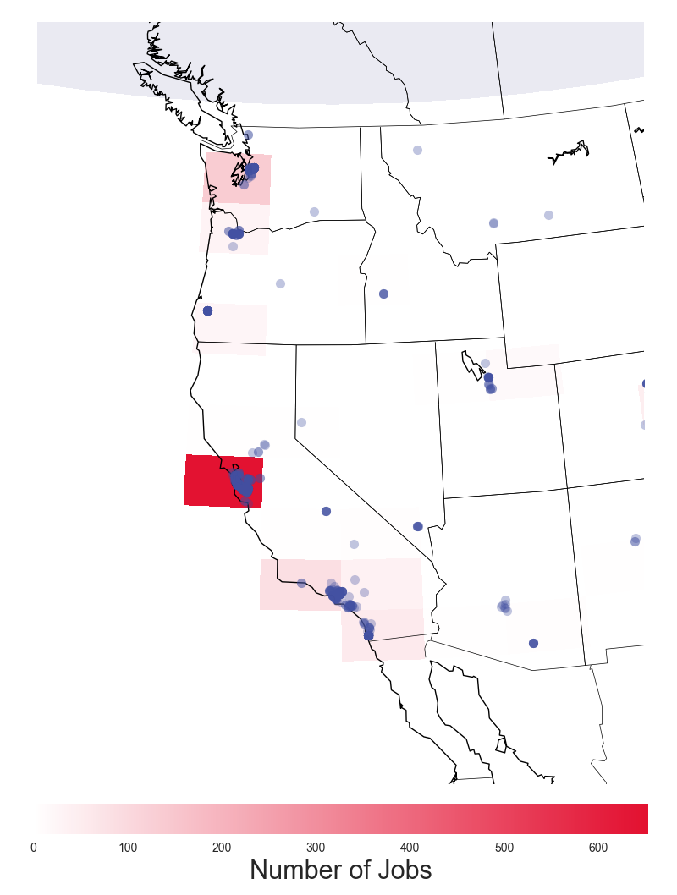

# [](#header-1)[Home](index) || [Research](research) || [<font color="MediumSlateBlue">Projects</font>](projects)
<br/>

* * * 

## [](#header-2)Projects

*   <font color="MediumSlateBlue">Indeed.com: Data Science, Machine Learning,<br/>& AI jobs across the US</font>
*   [Twitter Streaming & Sentiment Analysis for<br/>Game 7 of the NHL Eastern Conference Finals:<br/>Penguins vs. Senators](hockeytweets)<br/>
*   [(Kaggle) Titanic: Machine Learning from Disaster](kaggle_titanic)<br/>
<!-- *   [(Kaggle) House Prices: Advanced Regression Techniques](kaggle_houseprices)<br/> -->
<!-- *   [(Kaggle) Personalized Medicine: Redefining Cancer Treatment](kaggle_cancer)<br/> -->


* * * 
<br/>
# [](#header-1)<center><i>INDEED.COM: DATA SCIENCE, MACHINE LEARNING, AND AI JOBS ACROSS THE US<i/><center/>
<br/>
<br/>
# [](#header-2)I. INTRODUCTION
I got the idea for this project since I'm interested in data science, machine learning, and artificial intelligence, and I myself am looking for a career in these fields. I wanted to examine such things as geographical locations of jobs, company sizes (start ups vs. older corporations), company ratings, salary information, and possibly some common keywords given in job summaries that could give information on job requirements.

<br/>
<br/>
# [](#header-2)II. GETTING THE DATA
<br/>
# [](#header-3)<center>Part 1. Web Scraping<center/>

```python
import numpy as np
import requests
import time
import os

from bs4 import BeautifulSoup
```
```python 
def get_job_info(job):
    """
        We'll want: job title, company, location, 
                    salary (if given), company size, 
                    company rating, and a job summary.
    """

    try:
        job_title = str(job.find('h2', 'jobtitle').a.text.strip())
    except:
        job_title = 'NA'

    try:
        company = str(job.find('span', 'company').text.strip())
    except:
        company = 'NA'

    try:
        location = str(job.find('span', 'location').text.strip())
    except:
        location = 'NA'

    try:
        salary = str(job.find('span', 'no-wrap').text)
    except:
        salary = 'NA'

    try:
        company_size =  int(job.find('span', 'slNoUnderline').text.split()[0]) # assume the number of company ratings scales linearly with size
    except:
        company_size = 'nan'

    try:
        company_rating = float(job.find('span', 'rating').get('style')[6:10])
    except:
        company_rating = 'nan'
    
    try:
        summary = str(job.find('span', 'summary').text.strip()).replace('"', "'")
    except:
        print 'Could not get job summary for %s: %s.'%(company, job_title)
        summary = 'NA'
    

    return  job_title, company, location, salary, company_size, company_rating, summary
```
```python
def get_next_page(soup):
    """
    """
    next_page_info = soup.find('div', {'class':'pagination'})
    pages_list = next_page_info.find_all('a')
    next_page = pages_list[-1]
    # the new url has separate parts that we need to put together
    next_middle = next_page.get('href')
    next_end = next_page.get('data-pp')

    new_url = home + next_middle + '&pp=' + next_end

    print 'Next url --> ',new_url
    return new_url
```
```python 
sleep_time = 5 # wait 5 seconds before going to the next page
number_of_pages = 60
job_type = ['artificial', 'intelligence']

home = 'https://www.indeed.com'
url = home + '/jobs?q=%s+%s'%(job_type[0], job_type[1])
print 'First page --> ', url
html = requests.get(url).text
soup = BeautifulSoup(html, 'html5lib')

jobs = soup.find_all('div', {'class':' row result'})

next_page_number = 2
time.sleep(sleep_time) # it's polite to wait a little bit
while next_page_number <= number_of_pages:


    try:
        new_url = get_next_page(soup)
        new_html = requests.get(new_url).text
        new_soup = BeautifulSoup(new_html, 'html5lib')

        new_jobs = new_soup.find_all('div', {'class':' row result'})
        jobs = jobs + new_jobs
    
        soup = new_soup
        del(new_html, new_soup, new_jobs)
    except:
        print 'Could not load page %d'%next_page_number

    next_page_number += 1

    time.sleep(sleep_time)
```
```python
# write all of the lines to a .csv file
filename = 'new_' + job_type[0] + '_' + job_type[1] + '_jobs.csv'
if os.path.exists(filename):
    os.system('rm ' + filename) 

f = open(filename, 'a')
header =  '"jobtitle","company","location","salary","companysize","companyrating","summary"\n'
f.write(header)
for ii in xrange(len(jobs)):
    job_info = get_job_info(jobs[ii])
#    print job_info
    line = '"' + str(job_info[0]) + '","' + str(job_info[1]) + '","' + str(job_info[2]) + '","'\
               + str(job_info[3]) + '",' + str(job_info[4]) + ',' + str(job_info[5]) + ',"' + str(job_info[6]) + '"\n'
    f.write(line)

f.close()
```
<center>
</center>
<center>
</center>
<center>
</center>

