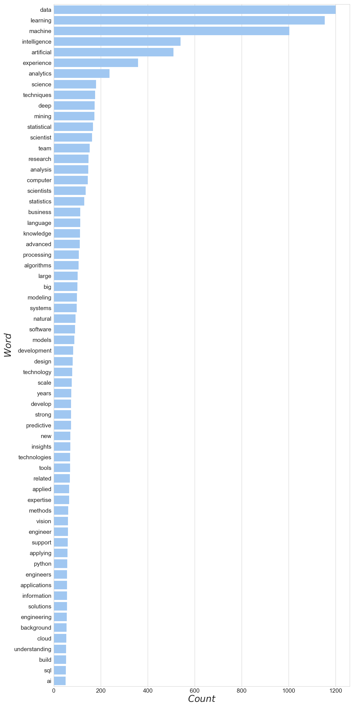
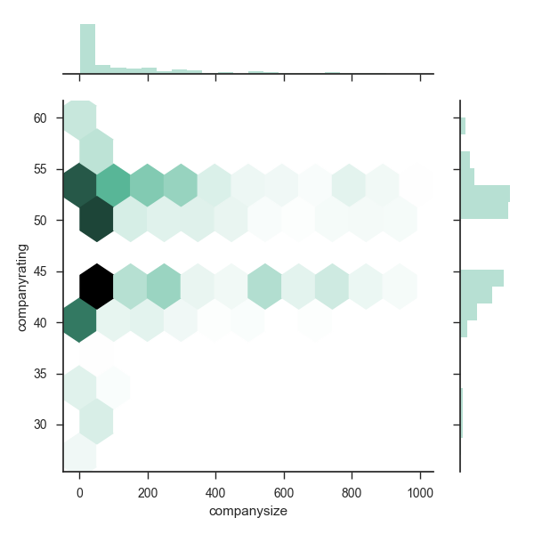
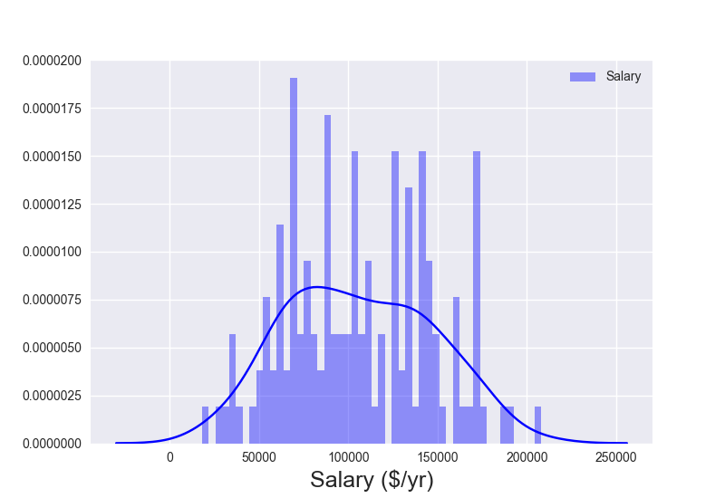
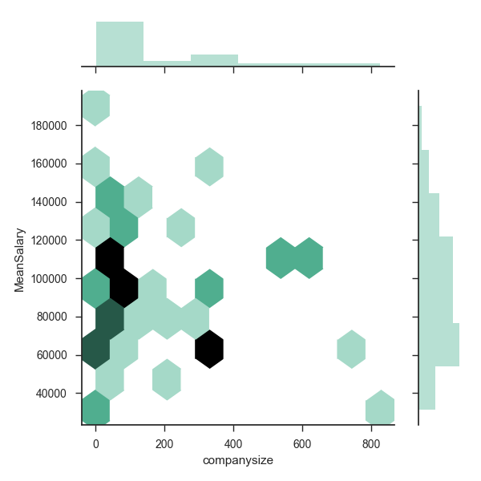

# [](#header-1)[Home](index) || [Research](research) || [<font color="MediumSlateBlue">Projects</font>](projects)
<br/>

* * * 

## [](#header-2)Projects

*   <font color="MediumSlateBlue">Indeed.com: Data Science, Machine Learning,<br/>& AI jobs across the US</font>
*   [Twitter Streaming & Sentiment Analysis for<br/>Game 7 of the NHL Eastern Conference Finals:<br/>Penguins vs. Senators](hockeytweets)<br/>
*   [(Kaggle) Titanic: Machine Learning from Disaster](kaggle_titanic)<br/>
<!-- *   [(Kaggle) House Prices: Advanced Regression Techniques](kaggle_houseprices)<br/> -->
<!-- *   [(Kaggle) Personalized Medicine: Redefining Cancer Treatment](kaggle_cancer)<br/> -->


* * * 
<br/>
# [](#header-1)<center><i>INDEED.COM: DATA SCIENCE, MACHINE LEARNING, AND AI JOBS ACROSS THE US<i/><center/>
<br/>
<br/>
# [](#header-2)I. INTRODUCTION
I got the idea for this project since I'm interested in data science, machine learning, and artificial intelligence, and I'm currently looking for a career in these fields. I wanted to examine such things as geographical locations of jobs, company sizes (start ups vs. older corporations), company ratings, salary information, and possibly some common keywords given in job summaries that could give information on job requirements.

The job listing contained in this analysis were scraped from Indeed.com on Sept. 5, 2017. It would be interesting to track some of the features over time to see if there are any seasonal or yearly changes in data science, machine learning, and artificial intelligence job opportunities.

The code that I wrote for this project can be found in my [Projects/Indeed](https://github.com/mrbrins82/Projects/tree/master/Indeed) repository.

<br/>
<br/>
# [](#header-2)II. GETTING THE DATA
<br/>
# [](#header-3)<center>Part 1. Web Scraping<center/>
Before scraping data from Indeed.com, I checked their <a href="https://www.indeed.com/robots.txt">robots.txt</a> page to see their rules about web crawling. There was nothing disallowed about scraping from general job search results, but they disallow scraping from their _/viewjobs?_ pages, which unfortunately means that I couldn't get any information from specific job pages. This means that I was limited to only getting summary information shown on the general search results pages. 

I performed three job searches with keywords: _Artificial Intelligence_, _Data Scientist_, and _Machine Learning_. I was able to scrape information for _jobtitle_, _company_, _location_, _salary_, _company size_, _company rating_, and the short _summary_, which I then wrote out to csv files for each job search. 

All of features for each job are straight forward in their meaning, except for the _company size_, and _company rating_ features. For company size, I used the number of ratings that a company has, assuming that a larger company is more likely to have more employees give a rating, and vice versa for smaller companies. To measure a company's rating, I use the number of stars given out of a maximum five star rating. Indeed doesn't give the number of stars, but rather the stars are filled in with yellow coloring that is given by a pixel width that I use as the metric for company rating. 

<br/>
# [](#header-3)<center>Part 2. Converting City Location to Coordinates<center/>
When scraping job listings from Indeed.com, we take in the city, state, and zip code. Sometimes we only get a city, sometimes we only get a state. We need to turn these locations into coordinates in order to plot job locations on a map of the US. Python has a method for doing this, but we're limited to 2500 requests per day (click <a href="https://developers.google.com/maps/documentation/geocoding/usage-limits">here</a> for usage limits page), for free at least. Rather than make these requests every time I ran the scraper, or wanted to make a plot, I decided to make this a separate program that could take locations that I already had and store the coordinates in another csv file, that could be used anytime in the future. Also, I won't have to make requests for coordinates to any new jobs in the future if I've already gotten them and have them stored in the _locations.csv_ file.

```python
import numpy as np
import pandas as pd
import os
 
from geopy.geocoders import Nominatim
 
# load job files
ai_df = pd.read_csv('jobs_artificial_intelligence.csv')
ds_df = pd.read_csv('jobs_data_scientist.csv')
ml_df = pd.read_csv('jobs_machine_learning.csv')
 
# make one data frame out of all job files and drop duplicates
all_df = pd.concat((ai_df, ds_df, ml_df))

df = all_df.drop_duplicates()
df.location = df.location.replace(to_replace='Santa Clara Valley, CA', value='Santa Clara, CA')
 
# load existing cities and coordinates
locations_df = pd.read_csv('locations.csv')
 
# see if we already have coordinates for each city and if not
# add it to the locations file
unique_locations = df.location.unique()
 
 
geolocator = Nominatim()
for city in unique_locations:
#    print city
    city_stem = city.partition('(')[0].rstrip()
 
    if locations_df.city.unique().__contains__(city_stem):
        print 'Already have coordinates for %s'%city_stem

    else:
        try:
            loc = geolocator.geocode(city_stem)
            print city_stem
            print loc.longitude, loc.latitude
 
            # write a new line to the locations file
            f = open('locations.csv', 'a')
            f.write('"' + city_stem + '",' + str(loc.longitude) + ',' + str(loc.latitude) + '\n')
            f.close()
 
        except:
            print 'Could not geolocate for --> %s'%city_stem
```

<br/>
<br/>
# [](#header-2)III. ANALYZING THE DATA
The code used in my analysis is aptly called _analysis.py_ and currently resides in my github repository <a href="https://github.com/mrbrins82/Projects/blob/master/Indeed/analysis.py" >here</a>.

Now that we have some data, let's take a look at it.
```python
import numpy as np
import pandas as pd
import matplotlib.pyplot as plt
import matplotlib.colors as colors
import seaborn as sns
import os, sys

"""
get_locations is my own script that get coordinates from 
the city locations in the job csv files. Uncomment the 
'import get_locations' line if new jobs/locations have
been added.
"""
#import get_locations
 
from mpl_toolkits.basemap import Basemap
from matplotlib.colors import LinearSegmentedColormap
 
# load the job csv files and the csv with coordinates
ai_df = pd.read_csv('jobs_artificial_intelligence.csv')
ds_df = pd.read_csv('jobs_data_scientist.csv')
ml_df = pd.read_csv('jobs_machine_learning.csv')
locations_df = pd.read_csv('locations.csv')

# tag each data frame by it's job keyword search
ai_df['keyword'] = 'AI'
ds_df['keyword'] = 'DS'
ml_df['keyword'] = 'ML'

# let's put all of the data frames together and drop duplicates
all_df = pd.concat((ai_df, ds_df, ml_df))

df = all_df.drop_duplicates()
locations_df = locations_df.drop_duplicates()

df.count()
```
```ipython
jobtitle         2732
company          2772
location         2775
salary            138
companysize      1228
companyrating    1904
summary          1639
keyword          2775
dtype: int64
```
We have a total of 2807 job listings (924 AI, 951 Data Science, 932 Machine Learning). There are 32 duplicate job listings which after dropping, leaves us with a grand total of 2775 job listings. As we can see, most of the features have a decent amount of values except for the _salary_ feature. 

<br/>
# [](#header-3)<center>Part 1. Who's hiring, and for what?</center>
Let's take a look at the top 25 companies in terms of total job listings broken down into artificial intelligence, machine learning, and data science jobs.
<center>
</center>
This is a pretty interesting plot. Here we have the top 25 companies in terms of number of total job listings. It's not surprising to see companies like Apple, Google, or Twitter in the list, but it is interesting to see what types of jobs these companies are hiring for. For example, Udacity Inc. is purely looking to fill artificial intelligence positions. Twitter, and McKinsey & Co. are only looking for data science and machine learning positions.

What are some of the most common job titles that people are hiring for?
<center>
</center>

<center>
</center>

The metric used for copany rating is pixel width. Indeed uses a five star rating system and the stars are filled in with a certain width of yellow coloring. The maximum value for this feature is 60, so it seems reasonable to assume that company ratings of 12, 24, 36, 48, and 60 correspond to a star rating of 1, 2, 3, 4, and 5.
<center>
</center>

<br/>
# [](#header-3)<center>Part 2. Job Location<center/>
There are many data science bootcamps across the country such as the Insight bootcamps, and Data Incubator bootcamps to name a couple. The locations of these bootcamps suggest that most of the jobs are located on the east and west coasts, but let's see exactly where the jobs that are on Indeed.com are located. The first plot we have is a map of the US, with individual jobs shown as blue dots along with bins whose color is determined by the number of jobs in said bins.
<center>
</center>
We can see that most jobs of these types are in fact located along the coasts, with the majority of jobs being located in the New York City and San Francisco areas. Jobs look to be a bit more spread out geographically in the eastern half of the country, whereas jobs in the west tend to be clustered in higher density regions. In the west, states like California and Washington have higher numbers of jobs, while most states in the west have few to no jobs at all.

Let's zoom in on the New York City location for a higher resolution look at job location.
<center>
</center>
It appears that the majority of east coast jobs are located in New York City, with the D.C. and Boston areas also having higher numbers of jobs as well.

Now let's zoom in on the San Francisco area.
<center>
</center>
There are two highly dense areas in the San Francisco area. The highest density for jobs is in the Silicon Valley area, which shouldn't come as much surprise since this is a well known location for tech jobs. The other high density region to the north corresponds to the Financial District of San Francisco, indicating that there is also opportunity within the financial sector for people looking for data science, machine learning, and artificial intelligence jobs. 


<br/>
# [](#header-3)<center>Part 3. Salary<center/>
A quick Google for _Data Scientist Salary_ will show that the national average salary is just shy of $125k per annum (based on 337 salaries provided anonymously to Glassdoor by Data Scientists). 

When scraping for jobs, I was able to get 138 values for salary. Some values were given in yearly salary, while others were given in monthly, and hourly rates. I've converted all values to yearly salary. For monthly rates, I simply multiplied by 12, and for hourly rates I multiplied by 2080 (the number of hours in a year assuming 52 40hr-work-weeks). Some listings give a range of salary, and others just give one value for salary. I've created new features to take into account the lower and upper values of the salary range, as well as the mean between the two. For jobs that only list one value for salary, the lower, upper, and mean values are all the same.

Let's see how our data compares to what Google shows.
```python
print df[['LowSalary', 'HighSalary', 'MeanSalary']].describe()
```
```ipython
           LowSalary     HighSalary     MeanSalary
count     138.000000     138.000000     138.000000
mean    90251.966667  121843.647826  106047.807246
std     38139.298629   47140.288128   40528.081740
min     12000.000000   24000.000000   18000.000000
25%     60000.000000   88213.000000   72500.000000
50%     90000.000000  120000.000000  103529.250000
75%    120000.000000  150000.000000  139202.500000
max    180000.000000  312000.000000  208000.000000
```
It looks like the mean value for HighSalary is more in line with Google's result. The mean value for MeanSalary comes in a bit lower than the national average at approximately $106k with a median value of about $103k. Below we plot the distribution of MeanSalary values (all salary plots will be of MeanSalary).
<center>
</center>

There are other factors that determine salary. Smaller start-up companies might not be able to offer the same higher salaries that larger, more established companies can. What is the relationship between salary and company size in our data? The next plot is a 2D hexbin plot showing MeanSalary in terms of company size. A histogram of these variables is also shown on the margins. Remember that the metric used for company size is the number of employee ratings, assuming that larger companies are likely to have more reviews than a smaller company.
<center>
</center>
From this plot, it's not very apparent that there is a distinct relationship between company size and salary. All we can really tell from this plot is that the majority of job listings that give salary information tend to be for smaller companies.

How does a company's rating relate to salary? The next plot is again a 2D hexbin plot as above. 
<center>
</center>
Most job listings that give salary information have somewhere between a 4 and 5 star rating, with the rest being in the 3 to 4 star range. There doesn't appear to be a very strong correlation between salary and company rating. More data for salary could show that there is correlation between company size and rating, but it is difficult to see with the amount of information we have here.

Can a job seeker expect a bump in salary if they decide to work in the east or the west? Let's split the country down the middle at a longitude of -100 and see if there are any salary differences.
```python
east_jobs_df = df[df.longitude >= -100]
west_jobs_df = df[df.longitude < -100]

print east_jobs_df.describe()
```
```ipython
       companysize  companyrating    longitude     latitude      LowSalary  \
count   713.000000    1062.000000  1517.000000  1517.000000      89.000000   
mean    194.039271      47.613559   -80.197013    38.487457   89515.826966   
std     246.988317       5.549867     9.436159     5.069326   38345.776427   
min       2.000000      27.000000   -99.639672   -22.181417   12000.000000   
25%      13.000000      43.200000   -85.759407    36.255354   60000.000000   
50%      74.000000      51.000000   -77.177633    40.349274   85000.000000   
75%     284.000000      52.200000   -73.986614    41.823989  120000.000000   
max     990.000000      60.000000    27.961990    45.075980  170000.000000   

          HighSalary     MeanSalary  
count      89.000000      89.000000  
mean   121664.274157  105590.050562  
std     48991.598302   41130.247660  
min     24000.000000   18000.000000  
25%     85000.000000   70000.000000  
50%    120000.000000  102500.000000  
75%    150000.000000  135000.000000  
max    312000.000000  208000.000000  
```
```python
print west_jobs_df.describe()
```
```ipython
       companysize  companyrating    longitude     latitude      LowSalary  \
count   507.000000     827.000000  1239.000000  1239.000000      49.000000   
mean    146.015779      48.852479  -119.697684    38.649811   91589.036735   
std     207.125279       5.409901     5.513568     4.145760   38119.912839   
min       2.000000      27.000000  -157.846644    21.325079   24000.000000   
25%       6.000000      43.800000  -122.330062    37.354113   56284.800000   
50%      49.000000      51.000000  -122.083210    37.453827   90000.000000   
75%     189.500000      52.200000  -118.396650    39.689400  120000.000000   
max     944.000000      60.000000  -100.445882    48.746878  180000.000000   

          HighSalary     MeanSalary  
count      49.000000      49.000000  
mean   122169.448980  106879.242857  
std     44068.770137   39818.363378  
min     29120.000000   29120.000000  
25%     90000.000000   75000.000000  
50%    120000.000000  104108.500000  
75%    160000.000000  140000.000000  
max    200000.000000  190000.000000
```
Salaries in the west look to be slightly higher than in the east, but with the small number of data it's hard to say if there's any statistical significance to the difference. The next plot shows the distributions of salaries for the east and west and it doesn't indicate a significant difference between east and west salaries.
<center>
</center>

<br/>
<br/>
# [](#header-2)IV. Summary

