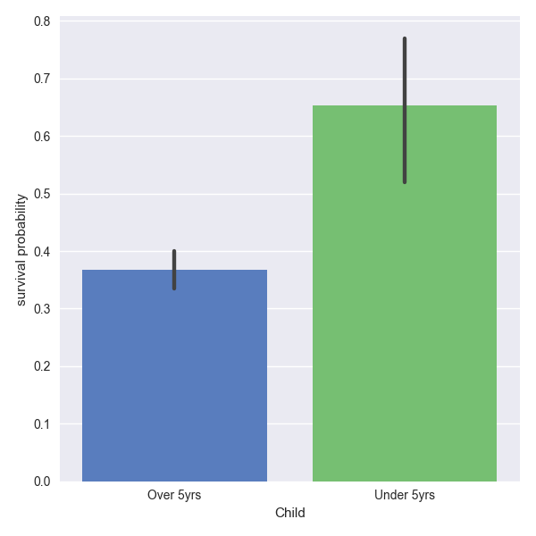
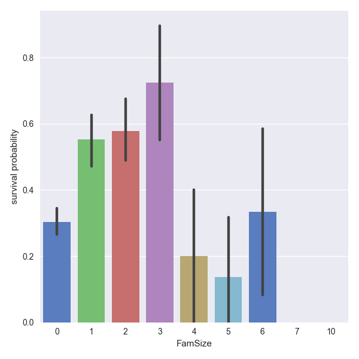
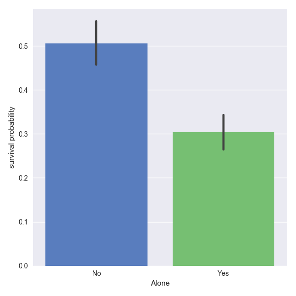
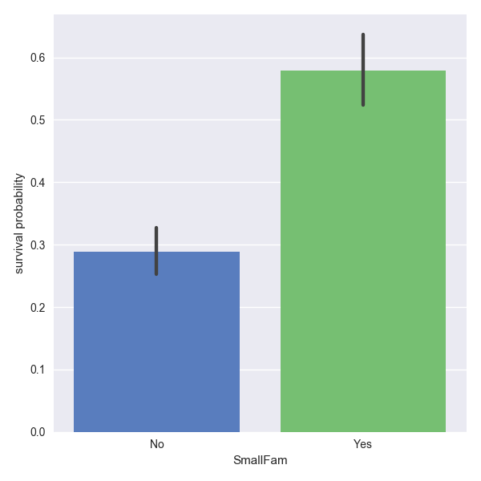
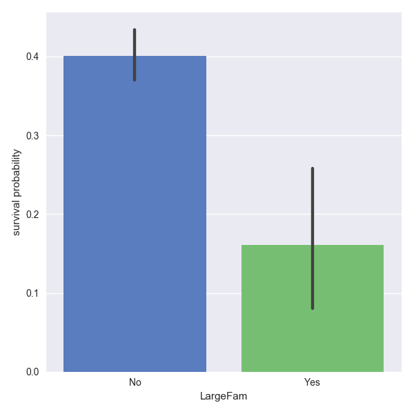
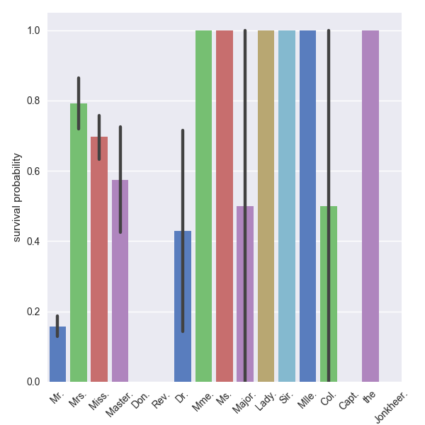
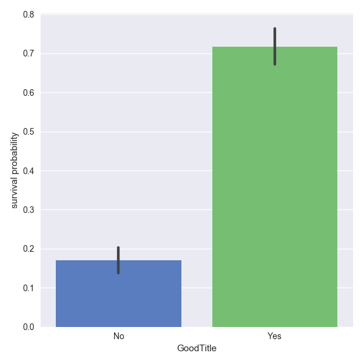
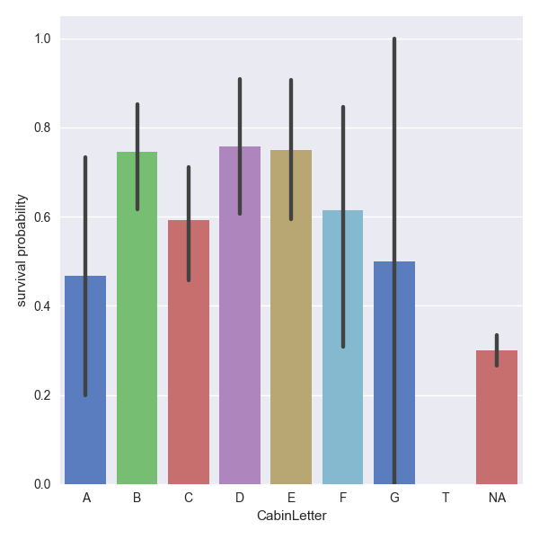
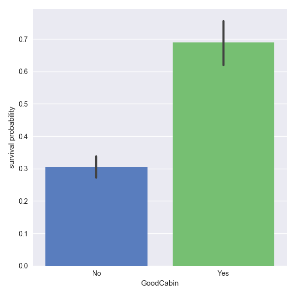

# [](#header-1)[Home](index) || [Research](research) || [<font color="MediumSlateBlue">Projects</font>](projects)
<br/>

* * * 

## [](#header-2)Projects

*   [Twitter Streaming & Sentiment Analysis for<br/>Game 7 of the NHL Eastern Conference Finals:<br/>Penguins vs. Senators](hockeytweets)<br/>
*   <font color="MediumSlateBlue">(Kaggle) Titanic: Machine Learning from Disaster</font>
*   [(Kaggle) House Prices: Advanced Regression Techniques](kaggle_houseprices)<br/>
*   [(Kaggle) Personalized Medicine: Redefining Cancer Treatment](kaggle_cancer)<br/>


* * *
<br/>
# [](#header-1)<center><i>TITANIC: MACHINE LEARNING FROM DISASTER<i/><center/>
<br/>
<br/>
# [](#header-2)I. INTRODUCTION
The sinking of the Titanic resulted in the loss of many lives. There were over 1500 deaths, accounting for approximately 2 out of every 3 people on the ship (passengers and crew combined). In this competition, Kaggle provides two data sets (a training set and a testing set) which contain numerical and categorical features for each of the passengers. The two sets contain the same numerical and categorical features, except that the training set also tells us if the passengers survived. The objective is to use the data to predict whether or not passengers in the testing data set survived or not. This is a binary classification problem, since we wish to classify each passenger as belonging to one of two classes: deceased, survived

In the following sections, I explain how I've developed a machine learning model that has scored over 80% accuracy, putting my submission in roughly the top 10% of submissions to the Kaggle Titanic competition.
<br/>
<br/>
# [](#header-2)II. EXPLORING THE DATA
<br/>
# [](#header-2)<center>Part 1. Loading the Data<center/>
The first thing we need to do is load the data and take a quick look at it to see what, if anything, we need to do with it.
```python
import numpy as np
import pandas as pd
import matplotlib.pyplot as plt
import seaborn as sns

from sklearn.preprocessing import LabelEncoder

# load the training and testing data files
train_df = pd.read_csv('train.csv')
test_df = pd.read_csv('test.csv')

# check to see if the data files have any missing values
print train_df.shape # gives dimension of training set
print train_df.count() # this will tell us how many non-NA values for each feature
```
```ipython
(891, 12)

PassengerId    891
Survived       891
Pclass         891
Name           891
Sex            891
Age            714
SibSp          891
Parch          891
Ticket         891
Fare           891
Cabin          204
Embarked       889
dtype: int64
```
```python
print test_df.shape
print test_df.count()
```
```ipython
(418, 11)

PassengerId    418
Pclass         418
Name           418
Sex            418
Age            332
SibSp          418
Parch          418
Ticket         418
Fare           417
Cabin           91
Embarked       418
dtype: int64
```

We can see that there are some missing values for the _Age_, _Cabin_, and _Embarked_ features in the training set and one missing _Fare_ value in the testing set as well. We will need to look at the importance of these features in terms of survival to decide whether or not we should fill in the missing values or if we can just drop any of them.

In order to build a classifier, all of the data must be in numerical form. If there are any categorial features, we will need to encode them. A quick check of the data types gives us
```python
print train_df.dtypes
```
```ipython
PassengerId      int64
Survived         int64
Pclass           int64
Name            object
Sex             object
Age            float64
SibSp            int64
Parch            int64
Ticket          object
Fare           float64
Cabin           object
Embarked        object
dtype: object
```

_Name_, _Sex_, _Ticket_, _Cabin_, and _Embarked_ are all categorical features. At this point, it's only useful to encode _Sex_ and _Embarked_ into numerical values since there are too many possible values for _Name_, _Ticket_, and _Cabin_. Before we can encode the _Sex_ and _Embarked_ features, we'll need to fill the two missing values for _Embarked_. Taking a quick look at the two passengers that don't have values for _Embarked_, we have
Embarked       889
```python
print train_df[train_df.Embarked.isnull()]
```
```ipython
     PassengerId  Survived  Pclass                                       Name  \
61            62         1       1                        Icard, Miss. Amelie   
829          830         1       1  Stone, Mrs. George Nelson (Martha Evelyn)   

        Sex   Age  SibSp  Parch  Ticket  Fare Cabin Embarked  
61   female  38.0      0      0  113572  80.0   B28      NaN  
829  female  62.0      0      0  113572  80.0   B28      NaN 
```

These are two 1st-class women that are on the same ticket and in the same cabin, so they probably boarded at the same location. How do we determine what to set as their port of embarkation? Let's look at a couple pivot tables and see if we can find any helpful information. The first pivot table shows a breakdown by _Sex_, _Pclass_, _Embarked_, and shows the number of people in each subset that embarked at a specific port. The second pivot table shows the same breakdown, except that instead of the number of people in each subset, it shows the survival probability.

```python
print train_df.pivot_table(values='Survived', index=['Sex', 'Pclass'], 
                     columns=['Embarked'], aggfunc='count')
```
```ipytyon
Embarked        C   Q    S
Sex    Pclass             
female 1       43   1   48
       2        7   2   67
       3       23  33   88
male   1       42   1   79
       2       10   1   97
       3       43  39  265
```
```python
print train_df.pivot_table(values='Survived', index=['Sex', 'Pclass'], 
                     columns=['Embarked'], aggfunc='mean')
```
```ipython
Embarked              C         Q         S
Sex    Pclass                              
female 1       0.976744  1.000000  0.958333
       2       1.000000  1.000000  0.910448
       3       0.652174  0.727273  0.375000
male   1       0.404762  0.000000  0.354430
       2       0.200000  0.000000  0.154639
       3       0.232558  0.076923  0.128302
```

The above two pivot tables show us that 1st-class women were approximately equally likely to board at either Cherbourg or Southampton. There is a slightly higher probability for 1st-class women that boarded at Cherbourg to survive, and since the two women missing _Embarked_ values survived, I'll choose to fill the missing values as Cherbourg.

```python
train_df.Embarked.iloc[61] = 'C'
train_df.Embarked.iloc[829] = 'C'
```

We are now ready to map the _Sex_ and _Embarked_ features to numerical values. For this, we can use sklearn's LabelEncoder.
```python
le_Sex = LabelEncoder()
train_df.Sex = le_Sex.fit_transform(train_df.Sex)
test_df.Sex = le_Sex.transform(test_df.Sex)

le_Embarked = LabelEncoder()
train_df.Embarked = le_Embarked.fit_transform(train_df.Embarked)
test_df.Embarked = le_Embarked.transform(test_df.Embarked)

```
<br/>
# [](#header-3)<center>Part 2. Feature Importance<center/>
At this point we've filled in a couple missing _Embarked_ values, and converted the cagetorical _Sex_, and _Embarked_ features into numerical values. We would like to now examine the strength of correlation that the data have with the target variable, _Survived_.
```python
print train_df.corr()
```
```ipython
             PassengerId  Survived    Pclass       Sex       Age     SibSp  \
PassengerId     1.000000 -0.005007 -0.035144  0.042939  0.036847 -0.057527   
Survived       -0.005007  1.000000 -0.338481 -0.543351 -0.077221 -0.035322   
Pclass         -0.035144 -0.338481  1.000000  0.131900 -0.369226  0.083081   
Sex             0.042939 -0.543351  0.131900  1.000000  0.093254 -0.114631   
Age             0.036847 -0.077221 -0.369226  0.093254  1.000000 -0.308247   
SibSp          -0.057527 -0.035322  0.083081 -0.114631 -0.308247  1.000000   
Parch          -0.001652  0.081629  0.018443 -0.245489 -0.189119  0.414838   
Fare            0.012658  0.257307 -0.549500 -0.182333  0.096067  0.159651   
Embarked        0.013078 -0.174199  0.170334  0.115513 -0.040248  0.070653   

                Parch      Fare  Embarked  
PassengerId -0.001652  0.012658  0.013078  
Survived     0.081629  0.257307 -0.174199  
Pclass       0.018443 -0.549500  0.170334  
Sex         -0.245489 -0.182333  0.115513  
Age         -0.189119  0.096067 -0.040248  
SibSp        0.414838  0.159651  0.070653  
Parch        1.000000  0.216225  0.042325  
Fare         0.216225  1.000000 -0.229304  
Embarked     0.042325 -0.229304  1.000000 
```

At first sight, the strongest correlations seem to be with _Pclass_, _Sex_, _Fare_, and _Embarked_. We can't write off the features with weaker correlations just yet as they may still contain some useful information.

In the next few subsections, we will examine each of the features individually and determine its usefulness for classification and if there are any new features that we can engineer from them.

# [](#header-3)_Pclass_
```python
sns.set_style(style="darkgrid")

g = sns.factorplot(x="Pclass", y="Survived", data=train_df, size=6,
                   kind="bar", palette="muted")
g.despine(left=True)
g.set_xticklabels(["1st", "2nd", "3rd"])
g.set_ylabels("survival probability")
plt.show()
```
<center>
</center>
_Pclass_ was one of the strong correlations with _Survived_, and the bar plot for survival probability by class supports the strong correlation. The standard deviations for each of the classes indicates that there is a definite statistical separation between each class. _Pclass_ is a pretty straighforward feature with not much else for us to do with it.
<br/>

# [](#header-3)_Sex_
```python
g = sns.factorplot(x="Sex", y="Survived", data=train_df, size=6, 
                   kind="bar", palette="muted")
g.despine(left=True)
g.set_xticklabels(["Female", "Male"])
g.set_ylabels("survival probability")
plt.show()
```
<center>
</center>
Women and children were the first into the lifeboats, so it's not surprising to see that women had a much higher probability for survival. As with _Pclass_, _Sex_ is another straightforward feature with not much else for us to do.
<br/>

# [](#header-3)_Age_
```python
survivors_df = train_df[train_df.Survived == 1]
deceased_df = train_df[train_df.Survived == 0]

sns.distplot(survivors_df.Age.dropna(), bins=40, norm_hist=False, 
             color='blue', label='Survived')
sns.distplot(deceased_df.Age.dropna(), bins=40, norm_hist=False, 
             color='red', label='Deceased')
plt.xlabel('Age (yrs)', size=18)
plt.legend(loc='upper right')
plt.show()
```
<center>
</center>
After looking at the above age distribution plot for the survivors and deceased, we can see why _Age_ didn't have such a high correlation to survival. The distribution is roughly the same for the survivors and for the deceased, except for a distinct difference for passengers under the age of about 5 years old. It looks like there's a sharp increase in survival probability for that age range. We will use this information to engineer a new feature later on.

<br/>
# [](#header-3)_SibSp_
```python
g = sns.factorplot(x="SibSp", y="Survived", data=train_df, size=6, 
                   kind="bar", palette="muted")
g.despine(left=True)
g.set_ylabels("survival probability")
plt.show()
```
<center>
</center>
The _SibSp_ feature tells us the number of siblings or spouses that accompanied each passenger. The bar plot doesn't provided much useful information other than that passengers with _SibSp_ values of 0 and 1 have lower and higher probabilities of survival respectively. We will hold off on doing anything with this feature until we have looked at the _Parch_ feature.

# [](#header-3)_Parch_
```python
g = sns.factorplot(x="Parch", y="Survived", data=train_df, size=6, 
                   kind="bar", palette="muted")
g.despine(left=True)
g.set_ylabels("survival probability")
plt.show()
```
<center>
</center>
The _Parch_ feature tells us the number of parents or children that accompanied each passenger. From the looks of this plot, passengers with 0 parents or children have a lower probability of survival, and passengers with 1 or 2 parents or children with them have a higher probability of survival. The other values have high deviations and so they don't provide much information.

It appears that both the _SibSp_ and _Parch_ features contain some information that can help classification. We can sum these features together to tell us how many total people are accompanying each passenger. We will do this later in the feature engineering section.

# [](#header-3)_Fare_
```python
sns.distplot(survivors_df.Fare, bins=100, norm_hist=False, color='blue', 
             label='Survived')
sns.distplot(deceased_df.Fare, bins=100, norm_hist=False, color='red', 
             label='Deceased')
plt.xlabel('Fare (pounds)', size=18)
plt.legend(loc='upper right')
plt.show()

```
<center>
</center>
Fares for the Titanic range from a few pounds to over 500 pounds. Passengers that paid a lower fare definitely have a lower probability of surviving as we can tell from this plot. Only a few people paid large amounts so let's zoom in on the _Fare_ distibution and only look at values below 150 pounds.
```python
sns.distplot(survivors_df.Fare, bins=160, norm_hist=False, color='blue', 
             label='Survived')
sns.distplot(deceased_df.Fare, bins=160, norm_hist=False, color='red', 
             label='Deceased')
plt.xlabel('Fare (pounds)', size=18)
plt.xlim(xmin=-10, xmax=150)
plt.legend(loc='upper right')
plt.show()
```
<center>
</center>
Judging from this plot, the distribution spike occurs for fares below approximately 10 pounds. We can use this to engineer a new feature later on as well.

<br/>
# [](#header-3)_Embarked_
```python
g = sns.factorplot(x="Embarked", y="Survived", data=train_df, size=6, 
                   kind="bar", palette="muted")
g.despine(left=True)
g.set_xticklabels(['Cherbourg', 'Queensland', 'Southampton'])
g.set_ylabels("survival probability")
plt.show()
```
<center>
</center>
Port of embarkation information is only statistically significant for passengers that boarded at Cherbourgh and Southampton, which have higher and lower survival probabilities respectively. Not as many passengers boarded at Queensland, which is why there is much more deviation in survival probability. There isn't much else that we can do with this feature, nevertheless it offers some useful information abouta passenger's chance of surviving.
<br/>
<br/>
# [](#header-2)III. CLEANING THE DATA
<br/>
# [](#header-2)<center>Part 1. Converting Categorical Data<center/>
The original data contained categorical features for _Name_, _Sex_, _Ticket_, _Cabin_, and _Embarked_. We have already converted the _Sex_ and _Embarked_ features, leaving us with _Name_, _Cabin_, and _Ticket_.
<br/>
# [](#header-3)_Ticket_
Looking at the _Ticket_ data in the training set, there are almost as many different ticket numbers as there are passengers.
```python
print train_df.Ticket.nunique()
```
```ipython
681
```
Not only that, but there doesn't seem to be much of a pattern in the ticket numbers. Some are numeric and some are alpha-numeric.
```python
print train_df.Ticket.unique()[:20]
```
```ipython
['A/5 21171' 'PC 17599' 'STON/O2. 3101282' '113803' '373450' '330877'
 '17463' '349909' '347742' '237736' 'PP 9549' '113783' 'A/5. 2151' '347082'
 '350406' '248706' '382652' '244373' '345763' '2649']
```
For these reasons, I'll just drop the _Ticket_ feature all together.
```python
train_df = train_df.drop(['Ticket'], axis=1)
test_df = test_df.drop(['Ticket'], axis=1)
```

This leaves us with _Cabin_ and _Name_. We'll start with encoding the _Cabin_ values first.

<br/>
# [](#header-3)_Cabin_
There are 147 unique cabin numbers in the training set.
```python
print train_df.Cabin.nunique()
print train_df.Cabin.unique()
```
```ipython
147

[nan 'C85' 'C123' 'E46' 'G6' 'C103' 'D56' 'A6' 'C23 C25 C27' 'B78' 'D33'
 'B30' 'C52' 'B28' 'C83' 'F33' 'F G73' 'E31' 'A5' 'D10 D12' 'D26' 'C110'
 'B58 B60' 'E101' 'F E69' 'D47' 'B86' 'F2' 'C2' 'E33' 'B19' 'A7' 'C49' 'F4'
 'A32' 'B4' 'B80' 'A31' 'D36' 'D15' 'C93' 'C78' 'D35' 'C87' 'B77' 'E67'
 'B94' 'C125' 'C99' 'C118' 'D7' 'A19' 'B49' 'D' 'C22 C26' 'C106' 'C65'
 'E36' 'C54' 'B57 B59 B63 B66' 'C7' 'E34' 'C32' 'B18' 'C124' 'C91' 'E40'
 'T' 'C128' 'D37' 'B35' 'E50' 'C82' 'B96 B98' 'E10' 'E44' 'A34' 'C104'
 'C111' 'C92' 'E38' 'D21' 'E12' 'E63' 'A14' 'B37' 'C30' 'D20' 'B79' 'E25'
 'D46' 'B73' 'C95' 'B38' 'B39' 'B22' 'C86' 'C70' 'A16' 'C101' 'C68' 'A10'
 'E68' 'B41' 'A20' 'D19' 'D50' 'D9' 'A23' 'B50' 'A26' 'D48' 'E58' 'C126'
 'B71' 'B51 B53 B55' 'D49' 'B5' 'B20' 'F G63' 'C62 C64' 'E24' 'C90' 'C45'
 'E8' 'B101' 'D45' 'C46' 'D30' 'E121' 'D11' 'E77' 'F38' 'B3' 'D6' 'B82 B84'
 'D17' 'A36' 'B102' 'B69' 'E49' 'C47' 'D28' 'E17' 'A24' 'C50' 'B42' 'C148']
```
We can see that all of the cabin numbers start with an identifying letter, so rather than encode every single cabin number, we can strip the first letter from each cabin and then encode that into a numerical feature. We will write our own function in order to do this, and then transform the training and testing _Cabin_ features by using sklearn's OneHotEncoder. Since there are a lot of missing values, we will fill them with a generic 'X' value..
```python
train_df.Cabin.fillna(value='X', inplace=True)
test_df.Cabin.fillna)value='X', inplace=True)

def get_cabin_letter(x):

    return str(x)[0]

train_df['CabinLetter'] = train_df.Cabin.apply(get_cabin_letter)
test_df['CabinLetter'] = test_df.Cabin.apply(get_cabin_letter)
```
Let's use one-hot-encoding on the cabin letters and then drop the original _Cabin_ feature.
```python
train_df = pd.get_dummies(train_df, columns=['CabinLetter'], prefix=['Cabin'])
test_df = pd.get_dummies(test_df, column=['CabinLetter'], prefix=['Cabin'])
test_df['Cabin_T'] = 0 # there is no T cabin in the test set

train_df = train_df.drop(['Cabin'], axis=1)
test_df = test_df.drop(['Cabin'], axis=1)
```

<br/>
# [](#header-3)_Name_
It goes without saying that there are as many names in the _Name_ feature as there are passengers, but if we look at a few of the values we can see that each passenger has a title in their name, _i_._e_. Mr., Mrs., Miss., etc. As we did with the _Cabin_ feature, we will write our own function that extracts the title from each passenger's name and then drop the original _Name_ feature once we have done that.
```python
def get_title(x):
    title = str(x).split(',')[1].lstrip().split(' ')[0]
    return title

train_df['Title'] = train_df.Name.apply(get_title)
test_df['Title'] = train_df.Name.apply(get_title)

train_df = train_df.drop(['Name'], axis=1)
test_df = test_df.drop(['Name'], axis=1)
```
Now all that remains is to encode the _Titles_ to numerical information.
```python
le_Title = LabelEncoder()

# need to make sure that we have all possible titles in both the training
# and testing set so that we can encode them
all_Titles = pd.concat((train_df.Title, test_df.Title))
le_Title.fit(all_Titles)
train_df['NumTitle'] = le_Title.transform(train_df.Title)
test_df['NumTitle'] = le_Title.transform(test_df.Title)
```
<br/>
# [](#header-2)<center>Part 2. Filling in Missing Values<center/>
We already filled in the two missing _Embarked_ values in the training data set and the missing _Cabin_ values in the previous sections, but we still need to fill in the missing ages. In the testing data set, we also need to fill in one missing fare. We will start with the missing ages.
<br/>
# [](#header-3)_Age_
There are many ways that we could fill in the missing age values. We could write a machine learning algorithm that would predict the ages based on the other features in the data sets, or we could just use a quick and simple method like using the mean age for passengers that are similar to the passenger with the missing age. We will just use the quick and simple method here.

We'll need to look at what features have strong correlations with passenger age in order to determine how to find similar passengers for calculating the mean age.
```python
print train_df.corr()['Age']
```
```ipython
PassengerId    0.036847
Survived      -0.077221
Pclass        -0.369226
Sex            0.093254
Age            1.000000
SibSp         -0.308247
Parch         -0.189119
Fare           0.096067
Embarked      -0.040248
Cabin_A        0.136309
Cabin_B        0.093914
Cabin_C        0.122041
Cabin_D        0.136975
Cabin_E        0.121440
Cabin_F       -0.083970
Cabin_G       -0.077296
Cabin_T        0.039474
Cabin_X       -0.249732
NumTitle       0.307794
Name: Age, dtype: float64
```
The features that are most strongly correlated with _Age_ (ignoring the individual cabin letters) are: _Pclass_, _SibSp_, _Parch_, and _NumTitle_. For each passenger that is missing an _Age_ value, we will find the other passengers that have the same strongly correlated features and compute the mean age and replace the missing value with this mean age.
```python
train_without_ages = train_df[train_df.Age.isnull()]
test_without_ages = test_df[test_df.Age.isnull()]

train_with_ages = train_df[train_df.Age.notnull()] # only use training data to fill ages

def get_mean_age(pclass, sibsp, parch, numtitle):

    # we need to make sure that the passenger with missing age
    # info is not a completely unique passenger, otherwise there
    # there will be no other passengers from which to calculate
    # a mean age, so we will update the mean age as we reduce
    # the temp_df
    temp_df = train_with_ages[train_with_ages.Pclass == pclass]
    if temp_df.shape[0] != 0:
        mean_age = temp_df.Age.mean()

    temp_df = temp_df[temp_df.Parch == parch]
    if temp_df.shape[0] != 0:
        mean_age = temp_df.Age.mean()

    temp_df = temp_df[temp_df.NumTitle == numtitle]
    if temp_df.shape[0] != 0:
        mean_age = temp_df.Age.mean()

    temp_df = temp_df[temp_df.SibSp == sibsp]
    if temp_df.shape[0] != 0:
        mean_age = temp_df.Age.mean()

    return mean_age

# fill in the train_df missing ages
for Id in train_without_ages.PassengerId:
    
    pclass = train_df.Pclass.iloc[Id - 1]
    sibsp = train_df.SibSp.iloc[Id - 1]
    parch = train_df.Parch.iloc[Id - 1]
    numtitle = train_df.NumTitle.iloc[Id - 1]

    train_df.Age.iloc[Id - 1] = get_mean_age(pclass, sibsp, parch, numtitle)

# fill in the test_df missing ages
for Id in test_without_ages.PassengerId:
    
    pclass = test_df.Pclass.iloc[Id - 892]
    sibsp = test_df.SibSp.iloc[Id - 892]
    parch = test_df.Parch.iloc[Id - 892]
    numtitle = test_df.NumTitle.iloc[Id - 892]

    test_df.Age.iloc[Id - 892] = get_mean_age(pclass, sibsp, parch, numtitle)
```
<br/>
# [](#header-3)_Fare_
There is one passenger in the testing data set that is missing a value for _Fare_. 
```python
print test_df[test_df.Fare.isnull()]
```
```ipython
     PassengerId  Pclass  Sex   Age  SibSp  Parch  Fare  Embarked  Cabin_A  \
152         1044       3    1  60.5      0      0   NaN         2        0   

     Cabin_B  Cabin_C  Cabin_D  Cabin_E  Cabin_F  Cabin_G  Cabin_X  Cabin_T  \
152        0        0        0        0        0        0        1        0   

    Title  NumTitle  
152   Mr.        11 
```
This is a 3rd-class male, and looking at the features that correlate the strongest with _Fare_, we can see that class plays the biggest role in determining the _Fare_ value. We will just set this passenger's fare to the mean fare value for 3rd-class passengers.
```python
test_df.Fare.iloc[152] = train_df[train_df.Pclass == 3].Fare.mean() # only use training data to fill missing fare
```
<br/>
<br/>
# [](#header-2)IV. FEATURE ENGINEERING
There were a few interesting features in the data that we can use to engineer some new features that will correlate well with survival probability. We will use the features that we saw in the _Age_, _SibSp_, _Parch_, _Fare_, and finally in the new _Title_ feature that we haven't examined yet.

<br/>
# [](#header-3)_Age_
In the age distribution plot, we saw that there was a definite spike in survival probability for passengers that were younger than about 5 years old. The new feature that we will create will be a binary feature called _Child_.
```python
def is_child(x):
    if int(x) <= 5:
        return 1
    else:
        return 0

train_df['Child'] = train_df.Age.apply(is_child)
test_df['Child'] = test_df.Age.apply(is_child)
```
Below we plot the survival probabilities for passengers over, and under the age of 5. The plot reflects the feature that we saw in the age distribution above by showing that there is a statistical importance to being either older or younger than 5 years old. The new _Child_ feature seems to be useful.
```python
g = sns.factorplot(x="Child", y="Survived", data=train_df, size=6, 
                   kind="bar", palette="muted")
g.despine(left=True)
g.set_xticklabels(['Over 5yrs', 'Under 5yrs'])
g.set_ylabels("survival probability")
plt.show()
```
<center>
</center>

<br/>
# [](#header-3)_SibSp_, and _Parch_
These features had a few values with some statistical significance and it's reasonable to assume that a passenger with more or fewer people accompanying them could play a role in their survival. We will create a new feature called _FamSize_ that will just be the sum of _SibSp_ and _Parch_.
```python
train_df['FamSize'] = train_df.SibSp + train_df.Parch
test_df['FamSize'] = test_df.SibSp + test_df.Parch
```
Let's take a look and see what the survival probabilities of _FamSize_ are.
```python
g = sns.factorplot(x="FamSize", y="Survived", data=train_df, size=6, 
                   kind="bar", palette="muted")
g.despine(left=True)
g.set_ylabels("survival probability")
plt.show()
```
<center>
</center>
Looking at the survival probabilities for different family sizes, it's clear that people who travelled alone had a significantly lower chance of surviving. People with family sizes of 1, 2, or 3 had a significantly higher chance of surviving. For passengers with families larger than that, it's a little less clear due to the variance in the data. We can create new binary features called _Alone_, _SmallFam_, and _LargeFam_ to cover these subsets.
```python
def is_alone(x):
    if int(x) == 0:
        return 1
    else:
        return 0

train_df['Alone'] = train_df.FamSize.apply(is_alone)
test_df['Alone'] = test_df.FamSize.apply(is_alone)

def is_small_fam(x):
    if int(x) == 0:
        return 0
    elif int(x) >= 4:
        return 0
    else:
        return 1

train_df['SmallFam'] = train_df.FamSize.apply(is_small_fam)
test_df['SmallFam'] = test_df.FamSize.apply(is_small_fam)

def is_large_fam(x):
    if int(x) >= 4:
        return 1
    else:
        return 0

train_df['LargeFam'] = train_df.FamSize.apply(is_large_fam)
test_df['LargeFam'] = test_df.FamSize.apply(is_large_fam)
```
```python
g = sns.factorplot(x="Alone", y="Survived", data=train_df, size=6, 
                   kind="bar", palette="muted")
g.despine(left=True)
g.set_xticklabels(['No', 'Yes'])
g.set_ylabels("survival probability")
plt.show()
```
<center>
</center>
```python
g = sns.factorplot(x="SmallFam", y="Survived", data=train_df, size=6, 
                   kind="bar", palette="muted")
g.despine(left=True)
g.set_xticklabels(['No', 'Yes'])
g.set_ylabels("survival probability")
plt.show()
```
<center>
</center>
```python
g = sns.factorplot(x="LargeFam", y="Survived", data=train_df, size=6, 
                   kind="bar", palette="muted")
g.despine(left=True)
g.set_xticklabels(['No', 'Yes'])
g.set_ylabels("survival probability")
plt.show()
```
<center>
</center>
From the above survival probability plots for _Alone_, _SmallFam_, and _LargeFam_, it appears as though these features will help our classifier. In each case, there is definite correlation between survival and family size.
<br/>
# [](#header-3)_Fare_
_Fare_ had one of the strongest correlations to survival when we first looked. If a passenger spends more on a ticket, then they are more likely to be wealthy and of a higher class, being correlated with higher survival chances. So the correlation with _Fare_ makes sense. We would expect passengers that paid a lower fare to have a lower chance of surviving, but the _Fare_ distribution plot that we showed earlier indicates that not only did passengers that paid a lower fare have a smaller chance of surviving, but that chance was much much lower than we might expect. The spike occurs roughly around the 10 pound mark, and so we will create a new binary feature called _LowFare_ that captures whether ticket fare is below or above this mark.
```python
def is_low_fare(x):
    if float(x) <= 10:
        return 1
    else:
        return 0

train_df['LowFare'] = train_df.Fare.apply(is_low_fare)
test_df['LowFare'] = test_df.Fare.apply(is_low_fare)
```
```python
g = sns.factorplot(x="LowFare", y="Survived", data=train_df, size=6, 
                   kind="bar", palette="muted")
g.despine(left=True)
g.set_xticklabels(['Over 10 pounds', 'Under 10 pounds'])
g.set_ylabels("survival probability")
plt.show()
```
<center>
</center>
The _LowFare_ survival probability plot indicates that those who paid a fare higher than 10 pounds were more than twice as likely to have survived, indicating that this is a good feature for our classifier.
<br/>
# [](#header-3)_Title_
_Title_ likely contains information regarding passenger sex, age, and possibly class which are all good indicators for survival. We can see that there are a few titles that have higher survival probablility. Namely, 'Mrs.', 'Miss.', and 'Master.'. This fact really captures the notion of women and children first. Passengers with the title 'Mr.' did not have a good chance of surviving. All of the other titles have a lot of variance in the probabilities since these titles appear much less frequently in the data.
```python
g = sns.factorplot(x="Title", y="Survived", data=train_df, size=6, 
                   kind="bar", palette="muted")
g.despine(left=True)
g.set_xticklabels(rotation=45)
g.set_ylabels("survival probability")
plt.show()
```
<center>
</center>
Let's make a new feature called _GoodTitle_ that separates high survivability titles from the others, and then drop the _Title_ feature.
```python
def is_good_title(x):
    if str(x) == 'Mrs.':
        return 1
    elif str(x) == 'Miss.':
        return 1
    elif str(x) == 'Master.':
        return 1
    else:
        return 0

train_df['GoodTitle'] = train_df.Title.apply(is_good_title)
test_df['GoodTitle'] = test_df.Title.apply(is_good_title)

train_df = train_df.drop(['Title'], axis=1)
test_df = test_df.drop(['Title'], axis=1)
```
```python
g = sns.factorplot(x="GoodTitle", y="Survived", data=train_df, size=6, 
                   kind="bar", palette="muted")
g.despine(left=True)
g.set_xticklabels(['No', 'Yes'])
g.set_ylabels("survival probability")
plt.show()
```
<center>
</center>
<br/>
# [](#header-3)_Cabin_
The Titanic sank in the middle of the night, so many passengers were probably sleeping in their cabins. Different parts of the ship may have had poor access to lifeboats and so _CabinLetter_ might be a good predictor of survival. The survival probabilities for each of the cabin letters is shown below.

Let's take a look at the survival probabilities for each cabin letter.
```python
g = sns.factorplot(x="CabinLetter", y="Survived", data=train_df, size=6, kind="bar", palette="muted")
g.despine(left=True)
g.set_ylabels("survival probability")
plt.show()
```
<center>
</center>
We can see that cabins beginning with _B_, _C_, _D_, or _E_ have significantly higher chances of survival. The other cabin letters either have low survival probability or a lower probability with higher variance. For these reasons, we will create a new feature called _GoodCabin_ separating these two cases.
```python
def is_good_cabin(x):
    if x == 'B':
        return 1
    elif x == 'C':
        return 1
    elif x == 'D':
        return 1
    elif x == 'E':
        return 1
    else:
        return 0

train_df['GoodCabin'] = train_df.CabinLetter.apply(is_good_cabin)
test_df['GoodCabin'] = test_df.CabinLetter.apply(is_good_cabin)
```
```python
g = sns.factorplot(x="GoodCabin", y="Survived", data=train_df, size=6, 
                   kind="bar", palette="muted")
g.despine(left=True)
g.set_xticklabels(['No', 'Yes'])
g.set_ylabels("survival probability")
plt.show()
```
<center>
</center>
Survival probability is more than twice as high for passengers in either a _B_, _C_, _D_, or _E_ cabin.

<br/>
# [](#header-3)Data Summary
Now that we have cleaned our data sets and engineered some new features, let's take one last look at our data to make sure that we haven't missed anything and see if our new features have good correlations with survival probability.
```python
print train_df.shape
print ''
print train_df.corr()['Survived']
print ''
print train_df.count()
```
```ipython
(891, 19)

PassengerId   -0.005007
Survived       1.000000
Pclass        -0.338481
Sex           -0.543351
Age           -0.064621
SibSp         -0.035322
Parch          0.081629
Fare           0.257307
Embarked      -0.174199
CabinLetter   -0.301116
NumTitle      -0.193635
Child          0.089465
FamSize        0.016639
Alone         -0.203367
SmallFam       0.279855
LargeFam      -0.125147
LowFare       -0.295081
GoodTitle      0.548092
GoodCabin      0.321393
Name: Survived, dtype: float64

PassengerId    891
Survived       891
Pclass         891
Sex            891
Age            891
SibSp          891
Parch          891
Fare           891
Embarked       891
CabinLetter    891
NumTitle       891
Child          891
FamSize        891
Alone          891
SmallFam       891
LargeFam       891
LowFare        891
GoodTitle      891
GoodCabin      891
dtype: int64
```
We also need to make sure that there are no missing values in the testing data set.
```python
print test_df.count()
```
```ipython
PassengerId    418
Pclass         418
Sex            418
Age            418
SibSp          418
Parch          418
Fare           418
Embarked       418
CabinLetter    418
NumTitle       418
Child          418
FamSize        418
Alone          418
SmallFam       418
LargeFam       418
LowFare        418
GoodTitle      418
GoodCabin      418
dtype: int64
```

<br/>
<br/>
# [](#header-2)V. CLASSIFICATION MODEL
<br/>
# [](#header-3)<center>Part 1. Choosing a Classifier<center/>
We have a training set with 891 rows and 19 columns, and a testing set with 418 rows and 18 columns. The goal is to train a machine learning model on the training set and predict the survival of each of the passengers of the testing set. Since survival is either a 0 or a 1 (deceased, survived respectively), this is a binary classification problem.

This is not a large data set, however with 18 features to train on, we have to eliminate some kinds of classifiers. K-neighbors classifiers do not perform very well in higher dimensions. This is due to the fact that distances between any two points begins to get very large as the number of dimensions increases. We could always perform dimension reduction by using principal component analysis (PCA), but we will look for a simpler, more straight forward method.

An important property to note is that some of the features in the data are nonlinear. _E_._g_. survival probability does not increase or decrease linearly as the _NumTitle_ increases. Encoding categorical features into numerical values can introduce nonlinearity. 

Random forests are good classifiers in these cases. They are good at handling nonlinear data, and perform well in higher dimensional data sets. I will use a boosted trees classifier using gradient boosting from the _xgboost_ package. I have found that it works quickly and produces good results.

<br/>
# [](#header-3)<center>Part 2. Building the Model<center/>
```python
from xgboost import XGBClassifier
from sklearn.model_selection import GridSearchCV
from sklearn.cross_validation import train_test_split
from sklearn.metrics import accuracy_score, precision_score, recall_score, f1_score

# we don't need the PassengerIds anymore and we don't want them to influence the
# classifier, we will need the PassengerIds for the training set later on when 
# we write the output file with all the the predictions
train_df = train_df.drop(['PassengerId'], axis=1)

test_Ids = test_df.PassengerId
test_df = test_df.drop(['PassengerId'], axis=1)
```
We'll need a way to evaluate how our model is performing. We don't know the correct predictions for the testing set, so we have to set aside some portion of the training data and check our predictions against the reserved portion. Sklearn has a nice function called <i>train_test_split</i> that does this for us.
```python
X = train_df.drop(['Survived'], axis=1)
Y = train_df.Survived

np.random.seed(random_state) # needs to be set so that the split is reproducible
x_train, x_test, y_train, y_test = train_test_split(X, Y) # default split is 75% train and 25% test
```
The _XGBClassifier_ has a lot of parameters, and we can use _GridSearchCV_ to test the classifier with different sets of these parameters and determine which set obtains the highest score determined by some scoring metric that we will provide. We'll use accuracy as our metric since that is how submissions are evaluated in this particular Kaggle competition.

It is not necessary to vary all of the classifier's parameters. We know what some of them should be set to given the type of problem.
```python
fixed_params = {'objective':'binary:logistic',
                'scale_pos_weight':1.605
                }

xgb = XGBClassifier(**fixed_params)
```
Now for the variable parameters. We could use as many of these as we like, but as the number of possibilities increases the computation time quickly becomes quite long.
```python
test_params = {'n_estimators':np.array([10, 25, 50]),
               'learning_rate':np.logspace(-3, -1, 3),
               'max_depth':np.array([3, 4, 5]),
               'gamma':np.array([0.0, 0.1]),
               'max_delta_step':np.array([0.0, 0.001, 0.01]),
               'reg_lambda':np.array([0.01, 0.1])
               }
```
With _GridSearchCV_, not only can we search for the optimal parameter set, but we can perform k-fold cross validation (another reason that checking too many parameters can take a long time). In cross validation, the training set is broken into k-parts and one is set aside as a validation set. The classifier then trains on the other (k-1)-parts. This process is performed k-times with each part being set aside as the validation set exactly once. This is helpful in preventing overfitting so that the classifier is better generalized.
```python
my_score = 'accuracy'
grid_search = GridSearchCV(xgb, test_params, n_jobs=-1, verbose=1,
                           scoring=my_score, cv=3)
grid_search.fit(x_train, y_train)
```
At this point, we have built a classification model and have trained it on 75% of our original training set, using a variety of parameters with 3-fold cross validation. We are now ready to make predictions and evaluate our model.

<br/>
# [](#header-3)<center>Part 3. Model Evaluation<center/>
Let's look at the highest accuracy score that our classifier got in the grid search and print out the optimal parameter set.
```python 
print 'Best %s score: %0.3f'%(my_score, grid_search.best_score_)
print 'Best Parameters:'
best_parameters = grid_search.best_estimator_.get_params()
for param_name in sorted(test_params.keys()):
    print '\t%s: %r'%(param_name, best_parameters[param_name])
```
```ipython
Best accuracy score: 0.832
Best Parameters:
    gamma: 0.10000000000000001
    learning_rate: 0.10000000000000001
    max_delta_step: 0.0
    max_depth: 4
    n_estimators: 50
    reg_lambda: 0.10000000000000001
```
The best classifier was over 83% correct. This is pretty good, compared to most scores on the Titanic submission leaderboard. It's possible that the classifier is a bit on the overfitted side though, so we can't assume that a high score on the training set automatically means a high score on any new data. Let's see if the classifier performs well on the portion of training data that we set aside earlier on.
```python
predictions_test = grid_search.predict(x_test)

print 'Scores for final validation set:'
print '\taccuracy score: %f'%accuracy_score(y_test, predictions_test)
print '\tprecision score: %f'%precision_score(y_test, predictions_test)
print '\trecall score: %f'%recall_score(y_test, predictions_test)
print '\tf1 score: %f'%f1_score(y_test, predictions_test)
```
```ipython
Scores for final validation set:
    accuracy score: 0.819005
    precision score: 0.744681
    recall score: 0.813953
    f1 score: 0.777778
```
This accuracy score is a little lower than the accuracy of the grid search. In addition to accuracy, we also have a few other classification scores. Precision is the next score, and a good way of thinking about precision is to say that for every positive class prediction, what are the odds that it is correct. In other words, of all of the times the classifier predicts that a passenger died, what is the probability that the passenger actually died? Mathematically, this is just
\begin{equation}
Precision = \frac{TP}{TP + FP}
\end{equation}
where _TP_ is the number of true positives, and _FP_ is the number of false positives.

The next score is the recall score. Recall is a measure of how many of the positive cases that our classifier catches, or, of all of the deceased passengers, how many did we get right? The expression for recall is
\begin{equation}
Recall = \frac{TP}{TP + FN}
\end{equation}
Note that the denominator has false negatives _FN_ instead of _FP_ like precision has.

Next, we have the F1 score. The F1 score is the harmonic mean of precision and recall. If we use precision as the only evaluation metric, it's entirely possible to do this at the expense of a bad recall score, and vice versa. As an example, imagine that we have a data set with 100 rows, and 10 of them belong to the positive class. We could build a classifier with 100% precision if all we do is correctly predict one member of the positive class. This would be a pretty conservative classifier, as it would predict the negative class almost all of the time unless it was absolutely certain that it could correctly predict the positive member. In this case, although we have 100% precision, the classifier would only have a 0.10 recall score since it only found one out of the total 10 positive class members. On the other hand, we could build a model that has 100% recall if we always predict the positive class. We would catch all of the positive cases this way. The downside to this classifier is that it only has a precision of 10%, since it is only right for the 10 positive cases and is wrong for the other 90 negative cases. The F1 score helps us make sure that we can get a good mix of precision and recall.  
\begin{equation}
F_1 = 2\frac{Precision \cdot Recall}{Precision + Recall}
\end{equationi}
The classifier is getting scores around the mid 70s to lower 80s and nothing seems glaringly detrimental. We are ready to make our final predictions and submit them to Kaggle for scoring.
<br/>
<br/>
# [](#header-2)VI. RESULTS
I have run this classifier using different numbers of k-fold cross validation, more grid search parameters, and using different scoring metrics in the grid search. The highest score that I've obtained as far as the Kaggle leaderboard goes is a little over 80% accuracy putting me in around the to 10% of submissions. On average, my submissions tend to score in the upper 70s for accuracy.
