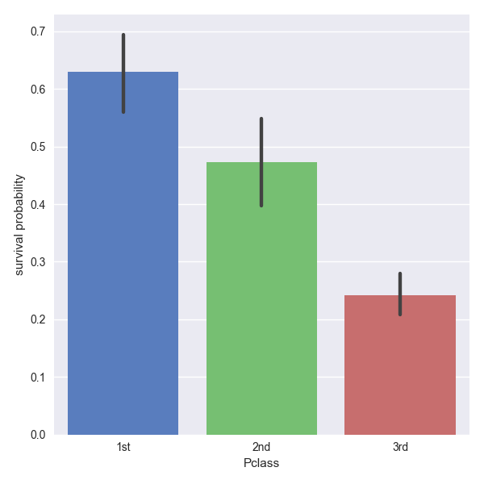
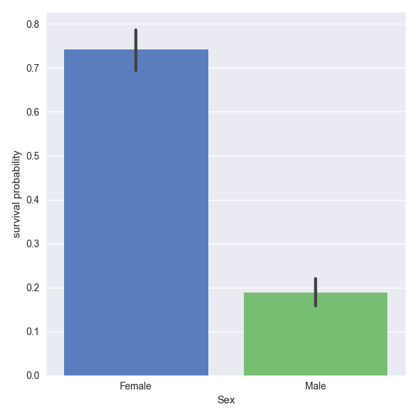
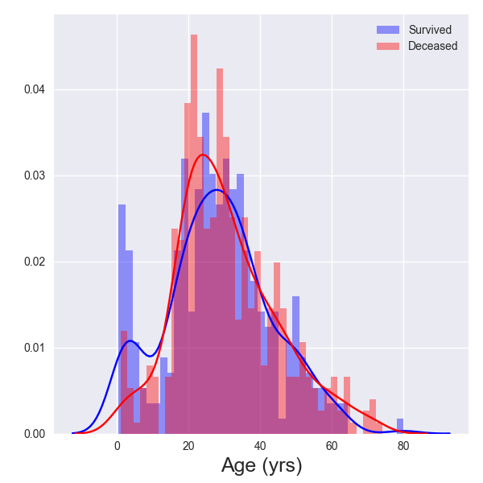
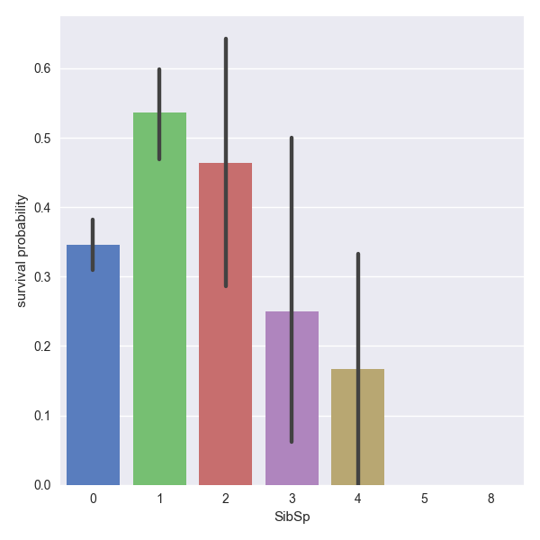
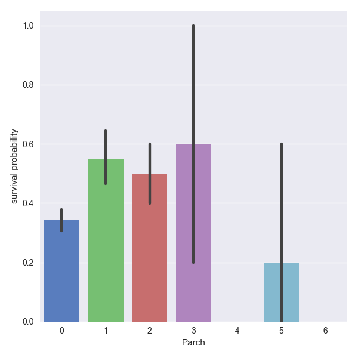
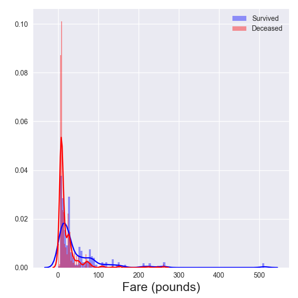
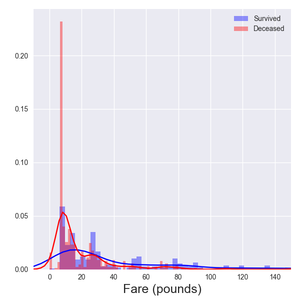
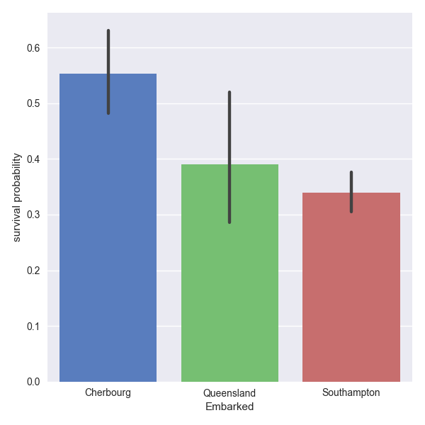

# [](#header-1)[Home](index) || [Research](research) || [<font color="MediumSlateBlue">Projects</font>](projects)
<br/>

* * * 

## [](#header-2)Projects

*   [Twitter Streaming & Sentiment Analysis for<br/>Game 7 of the NHL Eastern Conference Finals:<br/>Penguins vs. Senators](hockeytweets)<br/>
*   <font color="MediumSlateBlue">(Kaggle) Titanic: Machine Learning from Disaster</font>
*   [(Kaggle) House Prices: Advanced Regression Techniques](kaggle_houseprices)<br/>
*   [(Kaggle) Personalized Medicine: Redefining Cancer Treatment](kaggle_cancer)<br/>


* * *
<br/>
# [](#header-1)<center><i>TITANIC: MACHINE LEARNING FROM DISASTER<i/><center/>
<br/>
<br/>
# [](#header-2)I. INTRODUCTION
The sinking of the Titanic resulted in the loss of many lives. There were over 1500 deaths, accounting for approximately 2 out of every 3 people on the ship (passengers and crew combined). In this competition, Kaggle provides two data sets (a training set and a testing set) which contain numerical and categorical features for each of the passengers. The two sets contain the same numerical and categorical features, except that the training set also tells us if the passengers survived. The objective is to use the data to predict whether or not passengers in the testing data set survived or not. This is a binary classification problem, since we wish to classify each passenger as belonging to one of two classes: deceased, survived
<br/>
<br/>
# [](#header-2)II. EXPLORING THE DATA
<br/>
# [](#header-2)<center>Part 1. Loading the Data<center/>
The first thing we need to do is load the data and take a quick look at it to see what, if anything, we need to do with it.
```python
import pandas as pd
import matplotlib.pyplot as plt
import seaborn as sns

from sklearn.preprocessing import LabelEncoder

# load the training and testing data files
train_df = pd.read_csv('train.csv')
test_df = pd.read_csv('test.csv')

# check to see if the data files have any missing values
print train_df.shape # gives dimension of training set
print ''
print train_df.count() # this will tell us how many non-NA values for each feature
print ''
print train_df.dtypes # this will tell us what type of data each feature contains
```
```ipython
(891, 12)

Survived       891
Pclass         891
Name           891
Sex            891
Age            714
SibSp          891
Parch          891
Ticket         891
Fare           891
Cabin          204
Embarked       889

PassengerId      int64
Survived         int64
Pclass           int64
Name            object
Sex             object
Age            float64
SibSp            int64
Parch            int64
Ticket          object
Fare           float64
Cabin           object
Embarked        object

```
```python
print test_df.shape
print ''
print test_df.count()
```
```ipython
(418, 11)

PassengerId    418
Pclass         418
Name           418
Sex            418
Age            332
SibSp          418
Parch          418
Ticket         418
Fare           417
Cabin           91
Embarked       418
```

We can see that there are some missing values for the _Age_, _Cabin_, and _Embarked_ features in the training set and one missing _Fare_ value in the testing set as well. We will need to look at the importance of these features in terms of survival to decide whether or not we should fill in the missing values or if we can just drop any of them.

In order to build a classifier, all of the data must be in numerical form. If there are any categorial features, we will need to encode them. A quick check of the data types gives us
```python
print train_df.dtypes
```
```ipython
PassengerId      int64
Survived         int64
Pclass           int64
Name            object
Sex             object
Age            float64
SibSp            int64
Parch            int64
Ticket          object
Fare           float64
Cabin           object
Embarked        object
```

_Name_, _Sex_, _Ticket_, _Cabin_, and _Embarked_ are all categorical features. At this point, it's only useful to encode _Sex_ and _Embarked_ into numerical values since there are too many possible values for _Name_, _Ticket_, and _Cabin_. Before we can encode the _Sex_ and _Embarked_ features, we'll need to fill the two missing values for _Embarked_. Taking a quick look at the two passengers that don't have values for _Embarked_, we have
```python
print train_df[train_df.Embarked.isnull()]
```
```ipython
     PassengerId  Survived  Pclass                                       Name  \
61            62         1       1                        Icard, Miss. Amelie   
829          830         1       1  Stone, Mrs. George Nelson (Martha Evelyn)   

        Sex   Age  SibSp  Parch  Ticket  Fare Cabin Embarked  
61   female  38.0      0      0  113572  80.0   B28      NaN  
829  female  62.0      0      0  113572  80.0   B28      NaN 
```

These are two 1st-class women that are on the same ticket and in the same cabin, so they probably boarded at the same location. How do we determine what to set as their port of embarkation? Let's look at a couple pivot tables and see if we can find any helpful information. The first pivot table shows a breakdown by _Sex_, _Pclass_, _Embarked_, and shows the number of people in each subset that embarked at a specific port. The second pivot table shows the same breakdown, except that instead of the number of people in each subset, it shows the survival probability.

```python
train_df.pivot_table(values='Survived', index=['Sex', 'Pclass'], 
                     columns=['Embarked'], aggfunc='count')
```
```ipytyon
Embarked        C   Q    S
Sex    Pclass             
female 1       43   1   48
       2        7   2   67
       3       23  33   88
male   1       42   1   79
       2       10   1   97
       3       43  39  265
```
```python
train_df.pivot_table(values='Survived', index=['Sex', 'Pclass'], 
                     columns=['Embarked'], aggfunc='mean')
```
```ipython
Embarked              C         Q         S
Sex    Pclass                              
female 1       0.976744  1.000000  0.958333
       2       1.000000  1.000000  0.910448
       3       0.652174  0.727273  0.375000
male   1       0.404762  0.000000  0.354430
       2       0.200000  0.000000  0.154639
       3       0.232558  0.076923  0.128302
```

The above two pivot tables show us that 1st-class women were approximately equally likely to board at either Cherbourg or Southampton. There is a slightly higher probability for 1st-class women that boarded at Cherbourg to survive, and since the two women missing _Embarked_ values survived, I'll choose to fill the missing values as Cherbourg.

```python
train_df.Embarked.iloc[61] = 'C'
train_df.Embarked.iloc[829] = 'C'
```

We are now ready to map the _Sex_ and _Embarked_ features to numerical values. For this, we can use sklearn's LabelEncoder.
```python
le_Sex = LabelEncoder()
train_df.Sex = le_Sex.fit_transform(train_df.Sex)
test_df.Sex = le_Sex.transform(test_df.Sex)

le_Embarked = LabelEncoder()
train_df.Embarked = le_Embarked.fit_transform(train_df.Embarked)
test_df.Embarked = le_Embarked.transform(test_df.Embarked)

```
<br/>
# [](#header-3)<center>Part 2. Survival Probability by Feature<center/>
At this point we've filled in a couple missing _Embarked_ values, and converted the cagetorical _Sex_, and _Embarked_ features into numerical values. We would like to now examine the strength of correlation that the data have with the target variable, _Survived_.
```python
print train_df.corr()
```
```ipython
             PassengerId  Survived    Pclass       Sex       Age     SibSp  \
PassengerId     1.000000 -0.005007 -0.035144  0.042939  0.036847 -0.057527   
Survived       -0.005007  1.000000 -0.338481 -0.543351 -0.077221 -0.035322   
Pclass         -0.035144 -0.338481  1.000000  0.131900 -0.369226  0.083081   
Sex             0.042939 -0.543351  0.131900  1.000000  0.093254 -0.114631   
Age             0.036847 -0.077221 -0.369226  0.093254  1.000000 -0.308247   
SibSp          -0.057527 -0.035322  0.083081 -0.114631 -0.308247  1.000000   
Parch          -0.001652  0.081629  0.018443 -0.245489 -0.189119  0.414838   
Fare            0.012658  0.257307 -0.549500 -0.182333  0.096067  0.159651   
Embarked        0.013078 -0.174199  0.170334  0.115513 -0.040248  0.070653   

                Parch      Fare  Embarked  
PassengerId -0.001652  0.012658  0.013078  
Survived     0.081629  0.257307 -0.174199  
Pclass       0.018443 -0.549500  0.170334  
Sex         -0.245489 -0.182333  0.115513  
Age         -0.189119  0.096067 -0.040248  
SibSp        0.414838  0.159651  0.070653  
Parch        1.000000  0.216225  0.042325  
Fare         0.216225  1.000000 -0.229304  
Embarked     0.042325 -0.229304  1.000000 
```

At first sight, the strongest correlations seem to be with _Pclass_, _Sex_, _Fare_, and _Embarked_. We can't write off the features with weaker correlations just yet as they may still contain some useful information.

In the next few subsections, we will examine each of the features individually and determine its usefulness for classification and if there are any new features that we can engineer from them.

# [](#header-3)_Pclass_
```python
sns.set_style(style="darkgrid")

g = sns.factorplot(x="Pclass", y="Survived", data=train_df, size=6,
                   kind="bar", palette="muted")
g.despine(left=True)
g.set_xticklabels(["1st", "2nd", "3rd"])
g.set_ylabels("survival probability")
plt.show()
```
<center>
</center>
_Pclass_ was one of the strong correlations with _Survived_, and the bar plot for survival probability by class supports the strong correlation. The standard deviations for each of the classes indicates that there is a definite statistical separation between each class. _Pclass_ is a pretty straighforward feature with not much else for us to do with it.
<br/>

# [](#header-3)_Sex_
```python
g = sns.factorplot(x="Sex", y="Survived", data=train_df, size=6, 
                   kind="bar", palette="muted")
g.despine(left=True)
g.set_xticklabels(["Female", "Male"])
g.set_ylabels("survival probability")
plt.show()
```
<center>
</center>
Women and children were the first into the lifeboats, so it's not surprising to see that women had a much higher probability for survival. As with _Pclass_, _Sex_ is another straightforward feature with not much else for us to do.
<br/>

# [](#header-3)_Age_
```python
survivors_df = train_df[train_df.Survived == 1]
deceased_df = train_df[train_df.Survived == 0]

sns.distplot(survivors_df.Age.dropna(), bins=41, norm_hist=False, 
             color='blue', label='Survived')
sns.distplot(deceased_df.Age.dropna(), bins=41, norm_hist=False, 
             color='red', label='Deceased')
plt.xlabel('Age (yrs)', size=18)
plt.legend(loc='upper right')
plt.show()
```
<center>
</center>
After looking at the above age distribution plot for the survivors and deceased, we can see why _Age_ didn't have such a high correlation to survival. The distribution is roughly the same for the survivors and for the deceased, except for a distinct difference for passengers under the age of about 10 years old. It looks like there's a sharp increase in survival probability for that age range. We will use this information to engineer a new feature later on.

<br/>
# [](#header-3)_SibSp_
```python
g = sns.factorplot(x="SibSp", y="Survived", data=train_df, size=6, 
                   kind="bar", palette="muted")
g.despine(left=True)
g.set_ylabels("survival probability")
plt.show()
```
<center>
</center>
The _SibSp_ feature tells us the number of siblings or spouses that accompanied each passenger. The bar plot doesn't provided much useful information other than that passengers with _SibSp_ values of 0 and 1 have lower and higher probabilities of survival respectively. We will hold off on doing anything with this feature until we have looked at the _Parch_ feature.

# [](#header-3)_Parch_
```python
g = sns.factorplot(x="Parch", y="Survived", data=train_df, size=6, 
                   kind="bar", palette="muted")
g.despine(left=True)
g.set_ylabels("survival probability")
plt.show()
```
<center>
</center>
The _Parch_ feature tells us the number of parents or children that accompanied each passenger. From the looks of this plot, passengers with 0 parents or children have a lower probability of survival, and passengers with 1 or 2 parents or children with them have a higher probability of survival. The other values have high deviations and so they don't provide much information.

It appears that both the _SibSp_ and _Parch_ features contain some information that can help classification. We can sum these features together to tell us how many total people are accompanying each passenger. We will do this later in the feature engineering section.

# [](#header-3)_Fare_
```python
sns.distplot(survivors_df.Fare, bins=101, norm_hist=False, color='blue', 
             label='Survived')
sns.distplot(deceased_df.Fare, bins=101, norm_hist=False, color='red', 
             label='Deceased')
plt.xlabel('Fare (pounds)', size=18)
plt.legend(loc='upper right')
plt.show()

```
<center>
</center>
Fares for the Titanic range from a few pounds to over 500 pounds. Passengers that paid a lower fare definitely have a lower probability of surviving as we can tell from this plot. Only a few people paid large amounts so let's zoom in on the _Fare_ distibution and only look at values below 150 pounds.
```python
sns.distplot(survivors_df.Fare, bins=161, norm_hist=False, color='blue', 
             label='Survived')
sns.distplot(deceased_df.Fare, bins=161, norm_hist=False, color='red', 
             label='Deceased')
plt.xlabel('Fare (pounds)', size=18)
plt.xlim(xmin=-10, xmax=150)
plt.legend(loc='upper right')
plt.show()
```
<center>
</center>
Judging from this plot, the distribution spike occurs for fares below approximately 10 pounds. We can use this to engineer a new feature later on as well.

<br/>
# [](#header-3)_Embarked_
```python
g = sns.factorplot(x="Embarked", y="Survived", data=train_df, size=6, 
                   kind="bar", palette="muted")
g.despine(left=True)
g.set_xticklabels(['Cherbourg', 'Queensland', 'Southampton'])
g.set_ylabels("survival probability")
plt.show()
```
<center>
</center>
Port of embarkation information is only statistically significant for passengers that boarded at Cherbourgh and Southampton, which have higher and lower survival probabilities respectively. Not as many passengers boarded at Queensland, which is why there is much more deviation in survival probability. There isn't much else that we can do with this feature, nevertheless it offers some useful information abouta passenger's chance of surviving.

<br/>
# [](#header-2)III. CLEANING THE DATA
<br/>
# [](#header-2)<center>Part 1. Converting Categorical Data<center/>
The original data contained categorical features for _Name_, _Sex_, _Ticket_, _Cabin_, and _Embarked_. We have already converted the _Sex_ and _Embarked_ features, leaving us with _Name_, _Cabin_, and _Ticket_. Looking at the _Ticket_ data in the training set, there are almost as many different ticket numbers as there are passengers.
```python
print train_df.Ticket.nunique()
```
```ipython
681
```
Not only that, but there doesn't seem to be much of a pattern in the ticket numbers. Some are numeric and some are alpha-numeric.
```python
print train_df.Ticket.unique()[:20]
```
```ipython
array(['A/5 21171', 'PC 17599', 'STON/O2. 3101282', '113803', '373450',
       '330877', '17463', '349909', '347742', '237736', 'PP 9549',
       '113783', 'A/5. 2151', '347082', '350406', '248706', '382652',
       '244373', '345763', '2649'], dtype=object)
```
For these reasons, I'll just drop the _Ticket_ feature all together.
```python
train_df = train_df.drop(['Ticket'], axis=1)
test_df = test_df.drop(['Ticket'], axis=1)
```

This leaves us with _Cabin_ and _Name_. We'll start with encoding the _Cabin_ values first.

<br/>
# [](#header-3)_Cabin_
There are 147 unique cabin numbers in the training set.
```python
print train_df.Cabin.nunique()
print ''
print train_df.Cabin.unique()
```
```ipython
147

array([nan, 'C85', 'C123', 'E46', 'G6', 'C103', 'D56', 'A6', 'C23 C25 C27',
       'B78', 'D33', 'B30', 'C52', 'B28', 'C83', 'F33', 'F G73', 'E31',
       'A5', 'D10 D12', 'D26', 'C110', 'B58 B60', 'E101', 'F E69', 'D47',
       'B86', 'F2', 'C2', 'E33', 'B19', 'A7', 'C49', 'F4', 'A32', 'B4',
       'B80', 'A31', 'D36', 'D15', 'C93', 'C78', 'D35', 'C87', 'B77',
       'E67', 'B94', 'C125', 'C99', 'C118', 'D7', 'A19', 'B49', 'D',
       'C22 C26', 'C106', 'C65', 'E36', 'C54', 'B57 B59 B63 B66', 'C7',
       'E34', 'C32', 'B18', 'C124', 'C91', 'E40', 'T', 'C128', 'D37',
       'B35', 'E50', 'C82', 'B96 B98', 'E10', 'E44', 'A34', 'C104', 'C111',
       'C92', 'E38', 'D21', 'E12', 'E63', 'A14', 'B37', 'C30', 'D20',
       'B79', 'E25', 'D46', 'B73', 'C95', 'B38', 'B39', 'B22', 'C86',
       'C70', 'A16', 'C101', 'C68', 'A10', 'E68', 'B41', 'A20', 'D19',
       'D50', 'D9', 'A23', 'B50', 'A26', 'D48', 'E58', 'C126', 'B71',
       'B51 B53 B55', 'D49', 'B5', 'B20', 'F G63', 'C62 C64', 'E24', 'C90',
       'C45', 'E8', 'B101', 'D45', 'C46', 'D30', 'E121', 'D11', 'E77',
       'F38', 'B3', 'D6', 'B82 B84', 'D17', 'A36', 'B102', 'B69', 'E49',
       'C47', 'D28', 'E17', 'A24', 'C50', 'B42', 'C148'], dtype=object)
```
We can see that all of the cabin numbers start with an identifying letter, so rather than encode every single cabin number, we can strip the first letter from each cabin and then encode that into a numerical feature. We will write our own function in order to do this, and then transform the training and testing _Cabin_ features. Note that this function also handles the filling of missing values in the _Cabin_ feature.
```python
def cabin_letter(x):
    if str(x)[0] == 'A':
        return 1
    elif str(x)[0] == 'B':
        return 2
    elif str(x)[0] == 'C':
        return 3
    elif str(x)[0] == 'D':
        return 4
    elif str(x)[0] == 'E':
        return 5
    elif str(x)[0] == 'F':
        return 6
    elif str(x)[0] == 'G':
        return 7
    elif str(x)[0] == 'T':
        return 8
    else:
        return 9

train_df['CabinLetter'] = train_df.Cabin.apply(cabin_letter)
test_df['CabinLetter'] = test_df.Cabin.apply(cabin_letter)
```
We can just drop the original _Cabin_ feature now that we have extracted the more useful _CabinLetter_.
```python
train_df = train_df.drop(['Cabin'], axis=1)
test_df = test_df.drop(['Cabin'], axis=1)
```

<br/>
# [](#header-3)_Name_
It goes without saying that there are as many names in the _Name_ feature as there are passengers, but if we look at a few of the values we can see that each passenger has a title in their name, _i_._e_. Mr., Mrs., Miss., etc. As we did with the _Cabin_ feature, we will write our own function that extracts the title from each passenger's name and then drop the original _Name_ feature once we have done that.
```python
def get_title(x):
    title = str(x).split(',')[1].lstrip().split(' ')[0]
    return title

train_df['Title'] = train_df.Name.apply(get_title)
test_df['Title'] = train_df.Name.apply(get_title)

train_df = train_df.drop(['Name'], axis=1)
test_df = test_df.drop(['Name'], axis=1)
```
Now all that remains is to encode the _Titles_ to numerical information.
```python
le_Title = LabelEncoder()

# need to make sure that we have all possible titles in both the training
# and testing set so that we can encode them
all_Titles = pd.concat((train_df.Title, test_df.Title))
le_Title.fit(all_Titles)
train_df['NumTitle'] = le_Title.transform(train_df.Title)
test_df['NumTitle'] = le_Title.transform(test_df.Title)
```
<br/>
# [](#header-2)<center>Part 2. Filling in Missing Values<center/>
We already filled in the two missing _Embarked_ values in the training data set and the missing _Cabin_ values in the previous sections, but we still need to fill in the missing ages. In the testing data set, we also need to fill in one missing fare. We will start with the missing ages.
<br/>
# [](#header-3)_Age_
There are many ways that we could fill in the missing age values. We could write a machine learning algorithm that would predict the ages based on the other features in the data sets, or we could just use a quick and simple method like using the mean age for passengers that are similar to the passenger with the missing age. We will just use the quick and simple method here.

We'll need to look at what features have strong correlations with passenger age in order to determine how to find similar passengers for calculating the mean age.
```python
print train_df.corr()['Age']
```
```ipython
PassengerId    0.036847
Survived      -0.077221
Pclass        -0.369226
Sex            0.093254
Age            1.000000
SibSp         -0.308247
Parch         -0.189119
Fare           0.096067
Embarked      -0.030394
CabinLetter   -0.267270
NumTitle       0.307794
```
The features that are most strongly correlated with _Age_ are: _Pclass_, _SibSp_, _Parch_, _CabinLetter_, and _NumTitle_. For each passenger that is missing an _Age_ value, we will find the other passengers that have the same strongly correlated features and compute the mean age and replace the missing value with this mean age.
```python
train_without_ages = train_df[train_df.Age.isnull()]
test_without_ages = test_df[test_df.Age.isnull()]

train_with_ages = train_df[train_df.Age.notnull()] # only use training data to fill ages

def get_mean_age(pclass, sibsp, parch, cabinletter, numtitle):

    temp_df = train_with_ages[train_with_ages.Pclass == pclass]
    temp_df = temp_df[temp_df.SibSp == sibsp]
    temp_df = temp_df[temp_df.Parch == parch]
    temp_df = temp_df[temp_df.CabinLetter == cabinletter]
    temp_df = temp_df[temp_df.NumTitle == numtitle]

    mean_age = temp_df.Age.mean()

    return mean_age

# fill in the train_df missing ages
for Id in train_without_ages.PassengerId:
    
    pclass = train_df.Pclass.iloc[Id - 1]
    sibsp = train_df.SibSp.iloc[Id - 1]
    parch = train_df.Parch.iloc[Id - 1]
    cabinletter = train_df.CabinLetter.iloc[Id - 1]
    numtitle = train_df.NumTitle.iloc[Id - 1]

    train_df.Age.iloc[Id - 1] = get_mean_age(pclass, sibsp, parch, cabinletter, numtitle)

# fill in the test_df missing ages
for Id in test_without_ages.PassengerId:
    
    pclass = test_df.Pclass.iloc[Id - 892]
    sibsp = test_df.SibSp.iloc[Id - 892]
    parch = test_df.Parch.iloc[Id - 892]
    cabinletter = test_df.CabinLetter.iloc[Id - 892]
    numtitle = test_df.NumTitle.iloc[Id - 892]

    test_df.Age.iloc[Id - 892] = get_mean_age(pclass, sibsp, parch, cabinletter, numtitle)
```
<br/>
# [](#header-3)_Fare_

<br/>
# [](#header-2)IV. FEATURE ENGINEERING

