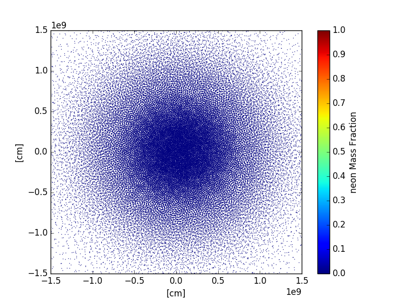
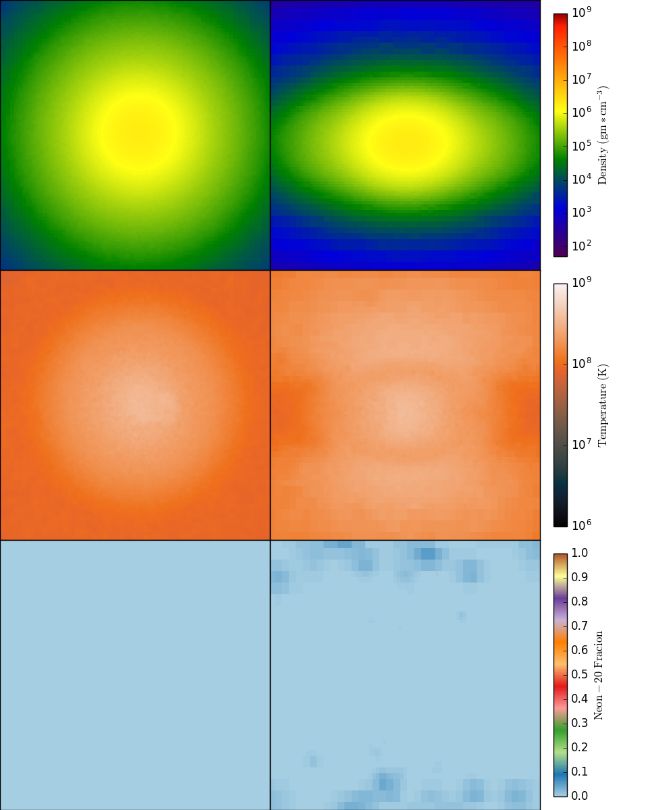
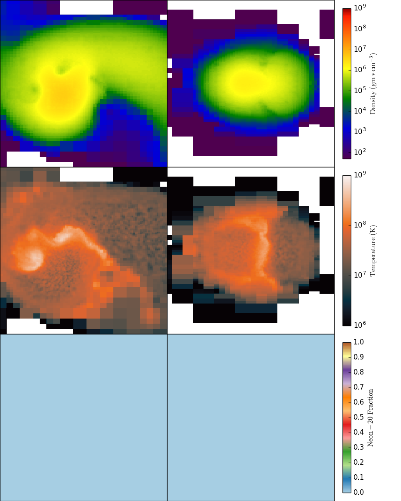
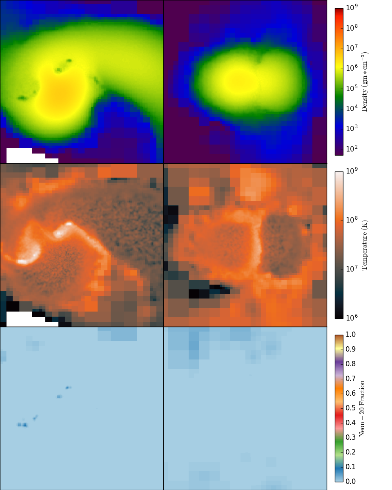
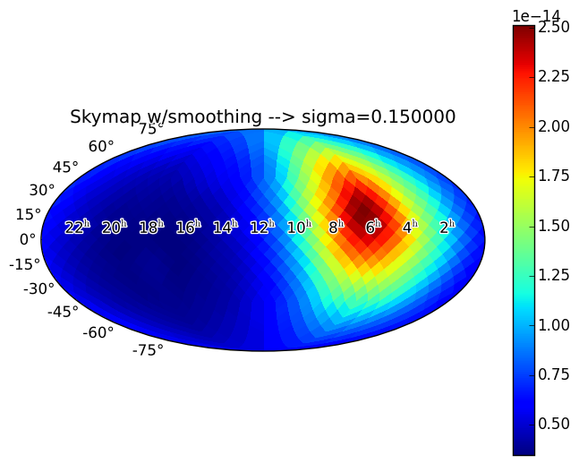

# [Home](index) || [Research](research) || [Projects](projects) || [Kaggle](kaggle)
 
 

# Research Page

##  Smoothed particle hydrodynamics (SPH) simulations of white binary white dwarf mergers

Research on progenitors of type Ia supernovae (SNe Ia) is an important area of astrophysics since the properties os SNe Ia are well understood, but the details of the mechanisms that produce them are not. SNe Ia data led to the discovery of the accelerated expansion of the universe, giving rise to theories of dark energy and dark matter, and has even suggested that Einstein's general relativistic model of gravity might need modification.

Several scenarios could possibly lead to SNe Ia, but my research focuses on the doubly degenerate model, which is a binary star system with two white dwarfs (WDs) that are in orbit around each other. As the WDs orbit one another, they radiate energy in the form of gravitational waves and gradually begin to merge with each other. These orbits are elliptical in general, but in my simulations I assume a circular orbit. Masses of WDs are comparable to that of our own sun, but most tend to be around 0.6-0.7 solar masses. In addition to different mass values, WDs also have different chemical profiles. In order to simulate mergers, I build WDs with different masses in the range of about 0.5-1.0 solar masses and chemical profiles that are appropriate for each mass value. Initially these WDs are composed primarily of helium-4, carbon-12, and oxygen-16. Previous research has not taken into account the effects of chemical abundances in triggering SNe Ia, and I have modified the existing SPH code <a href="http://www-hpcc.astro.washington.edu/tools/changa.html">ChaNGa</a> to incorporate the nuclear fusion that might be triggered during the merger process if the temperature reaches high enough levels. If nuclear fusion is triggered, then this could raise temperatures even higher and produce a SN Ia.

SPH simulations are an invaluable tool in performing fluid dynamics simulations. They allow a complicated fluid dynamics problem to be treated as a much simpler particle dynamics problem. Each of the particles in the simulation has physical properties associated with it such as mass, density, or temperature, and from the individual particle properties we can interpolate the value of the smoothed field for any of these properties. So even though there are regions of space that do not have any particles, we can still compute a value of temperature, for example, in those regions. The next two images demonstrate this concept. These plots are of a merger between two 0.583 solar mass WDs fairly late in the merger process (nearly spherical symmetry). This simulation used approximately 500k particles in total (I found that 500k particles was a good balance between maximizing resolution and minimizing computational costs). The first plot is just a scatter plot of all of the particles located in a thin slice along the orbital (xy) plane. The color of each particle represents the mass fraction of neon-20 that the particle contains, and we can see that there is very little neon in the system. The second plot shows the smoothed fields for density, temperature, and neon-20. What little neon has been produced by fusion in this simulation is located above and below the orbital plane. The three images on the left hand column of the second plot are slices in the xy-plane, while the right hand column are in the yz-plane. Each window is 3e9 centimeters to a side.

To demonstrate the effects of nuclear fusion in my models, look at the next two images. These are both slice plots in the xy-plane and the yz-plane (left column and right column respectively) showing the smoothed fields for density, temperature, and neon-20 mass fraction. The dimensions for each window is again 3e9 centimeters on each side. These simulations are both for a 0.651 solar mass accretor WD and a 0.610 solar mass donor WD. The diffrence between the two is that the first plot is run without the nuclear fusion model, and the second plot includes nuclear fusion. Both models are similar, except that in the burning model there appear some high temperature pockets at certain locations that indicate that the nuclear fusion process (in this case helium-4 and oxygen-16 are fusing to produce neon-20) is releasing additional thermal energy into the system.

##  Data analysis of NANOGrav 9yr data set

<a href="http://nanograv.org">NANOGrav</a> is one of several scientific collaborations across the globe that uses pulsar timing arrays in order to detect gravitational waves (GWs). Pulsars are like interstellar lighthouses, each emitting signals at regular intervals, and we can predict when each pulse should arrive at the Earth. By taking the difference between the expected time-of-arrival (TOA) and the actual TOA, we obtain residuals for each measurement. These residuals can be used to detect GWs, since a passing GW will stretch and compress spacetime between the Earth and the pulsar. This varyation in spacetime contributes to earlier- or later-than-expected TOAs for the pulses. NANOGrav is most sensitive to GWs with frequencies in the nanohertz range. To put it another way, these GWs have periods of oscillation on the order of years to tens of years.

In my work, I analyzed the NANOGrav 9yr data set in the efforts to detect continuous GW sources. The data consist of observations of 37 (17 in the 5yr data set) millisecond pulsars (MSPs) spanning a 9yr observation from 2004 to 2013. All data obtained for the 5yr data set were reprocessed along with the data obtained since then. Each MSP was observed from the Aricebo observatory or the Green Bank Telescope with the exception of a couple pulsars that were observed with both. Observations of these pulsars occured typically at monthly intervals with observation durations of about a half of an hour. All TOA data have been made publicly available on the NANOGrav website.

Using a Markov Chain Monte Carlo algorithm on the 9yr data set, we placed a 95% upper limit on GW strain at a value less than or equal to just under 2e-14 at a frequency of about 8nHz. this eliminates the possibility of a continuous wave source emitting GWs at this frequency, and with a chirp mass of 10 billion solar masses out to a distance of approximately 1.2Gpc. For the sky region where we are the most sensitive, the upper limit is reduced further to values less than or equal to 3e-5 and we can rule out any sources within a distance of about 4Gpc at the same frequency and chirp mass.

The current calculation of the upper limit on the strain is an improvement by a factor of about 2 or 3 compared to our previous result of less than or equal to 4e-14 at a frequency of 10nHz. Our limit on luminosity distance is improved by about the same factor of 3 from the previous result, which was greater than or equal to about 425Mpc at a frequency of 10nHz and chirp mass of 10 billion solar masses.

The skymap below shows the sensitivity of NANOGrav to continuous GW sources. The parameter "sigma" is just a smoothing factor for the skymap. Using the points with maximum and minimum sensitivity from the skymap, we were able to compute both the maximum and minimum strain as a function of frequency, shown in the final plot below. This plot also shows sources of continuous GWs as purple dots and the purple diamond located at the frequency and amplitude at which it should emit.

<object width="500" height="400" data="./assets/images/gw_strain_with_sources.pdf"></object>

